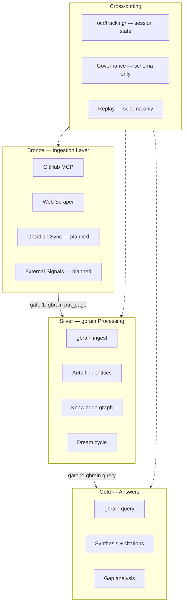

# OCR — Agents Architecture

## Purpose

This document describes the current architecture of the Organizational Cognition Runtime (OCR). It is a living constitution — updated when the architecture changes, not when code is written.

It is built from:
- `docs/architecture/bronze-silver-gold-pipeline.md` — current Medallion architecture
- `docs/adrs/ADR-0006-medallion-gates-before-agents.md` — gates-first build order
- `raw/repos/gbrain/` — garrytan/gbrain (the Silver/Gold layer)
- `raw/repos/gstack/` — garrytan/gstack (the skill format reference)

Session state tracking is in `ocr/tracking/` — see `ocr/tracking/PROTOCOL.md`.

> **City Map:** See `CITY_MAP.md` for the complete district atlas. `_index.md` files in each directory are the neighborhood signposts.

---

## Current Architecture: Medallion (Bronze → Silver → Gold)

OCR is not a generic agent platform. It is a **Medallion data pipeline** adapted for organizational cognition. Data flows through three layers:

```
Bronze (ingest everything)
  │  gate 1 — gbrain ingest (normalize, dedup, entity extraction)
  ▼
Silver (gbrain processing)
  │  Knowledge graph, entity enrichment, auto-linking, dream cycle
  ▼
gate 2 — gbrain query (synthesis with citations, gap analysis)
  │
Gold (answers)
```

### What exists today

| Layer | Component | Status | Location |
|-------|-----------|--------|----------|
| **Bronze** | GitHub MCP ingestion | Built — fetches commits, diffs, authors | `ingestion/github/adapter.py` |
| **Bronze** | Web scraper (ScraperRouter) | Built — 3-tier: Scrapling, Firecrawl, Playwright | `ingestion/web/scraper.py` |
| **Bronze** | FastAPI server | Built — health, CORS, ingestion api | `src/main.py` |
| **Bronze** | PostgreSQL schema | Built — shipments, councils, ontology, audit | `ledger/schemas/001_init.sql` |
| **Bronze** | Docker Compose | Built — postgres, redis, ollama, fastapi, nginx | `docker-compose.yml` |
| **Silver** | gbrain (memory/search/synthesis) | Cloned reference — not yet wired | `raw/repos/gbrain/` |
| **Gold** | gbrain query | Cloned reference — not yet wired | `raw/repos/gbrain/` |
| **Cross** | Session tracking | Built — SESSION.md, LOG.md, DECISIONS.md, ckpt | `ocr/tracking/` |
| **Cross** | Executive dashboard | Stub — static HTML, no live updates | `surfaces/executive/index.html` |

### What is designed but not built

| Component | Design location | What's missing |
|-----------|----------------|----------------|
| Skill activation engine | `raw/bronze-docs/04_gstack_skill_activation_runtime.md` | No runtime code. Formula is design-only. |
| Council orchestration | `raw/bronze-docs/05_council_architecture.md` | No runtime code. `councils` table exists. |
| Chairman synthesis | `raw/bronze-docs/05_council_architecture.md` | No runtime code. |
| Governance engine | `docs/adrs/ADR-0005-governance-before-autonomy.md` | Schema has fields. No enforcement. |
| Ontology extraction | `docs/adrs/ADR-0003-ontology-lifecycle-governance.md` | `ontology_nodes` table exists. No extraction. |
| Replay manager | `docs/adrs/ADR-0004-replayability-requirements.md` | `replay_sessions` table exists. No runtime. |
| n8n orchestration | `raw/bronze-docs/12_n8n_dag_architecture.md` | No config, no service, no DAGs. |
| Obsidian sync | `ingestion/obsidian/` | Directory scaffold only. |
| WebSocket surfaces | `raw/bronze-docs/10_executive_cognition_surfaces.md` | No WebSocket endpoint in FastAPI. |
| Auth (Keycloak) | `raw/bronze-docs/20_deployment_architecture.md` | No service, no middleware. |

### What was cancelled

| Cancelled | Superseded by |
|-----------|---------------|
| Custom GBrain (5 memory layers, custom activation) | `garrytan/gbrain` — production-tested, 20K★ |
| Neo4j graph database | PostgreSQL + pgvector — simpler stack |
| Custom search (vector + graph + temporal indices) | gbrain hybrid search — 49.1% P@5 |

---

## Architecture Diagram



---

## Build Order (ADR-0006)

Per ADR-0006 (Medallion Gates Before Agents), the build order is:

1. **Gate 1** (Bronze -> Silver) — wire gbrain ingest into GitHub MCP and web scraper
2. **Gate 2** (Silver -> Gold) — wire gbrain query into executive surfaces
3. **Skills** — gstack-style SKILL.md skills on top of gbrain context
4. **Councils** — parallel skill deliberation with chairman synthesis
5. **Governance** — policy engine, access control, replay

Currently: Gate 0 (bronze ingestion) is built. Gate 1 (gbrain wire-up) is next.

---

## Service Deployment

| Service | Status | Port |
|---------|--------|------|
| PostgreSQL 16 | Built | 5432 |
| Redis 7 | Built | 6379 |
| Ollama | Built | 11434 |
| FastAPI | Built | 8000 |
| Nginx | Built | 80 |

Not deployed: n8n, gbrain, Keycloak, WebSocket.

---

## Session Tracking

All agent sessions tracked in `ocr/tracking/`:

| File | Purpose |
|------|---------|
| `SESSION.md` | Active session — goal, progress, decisions, context |
| `LOG.md` | Append-only session history |
| `DECISIONS.md` | Append-only decision log |
| `CHECKPOINTS.md` | Registry: ckpt step -> git hash -> description |
| `STATE.json` | Machine-readable state (for scripts/CI) |

Protocol: `ocr/tracking/PROTOCOL.md`.

---

## Related Documents

- `docs/architecture/bronze-silver-gold-pipeline.md` — Canonical architecture
- `docs/adrs/ADR-0006-medallion-gates-before-agents.md` — Build order
- `docs/ingestion/scrape_router.md` — Scraper Router design
- `docs/adrs/` — All 7 ADRs
- `docs/governance/medallion-gates-guide.md` — Gate enforcement guide
- `raw/repos/gbrain/_index.md` — gbrain reference
- `raw/repos/gstack/_index.md` — gstack reference
- `ocr/tracking/PROTOCOL.md` — Session tracking protocol
