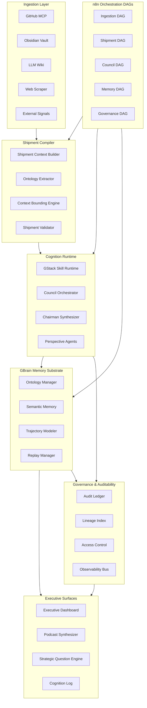
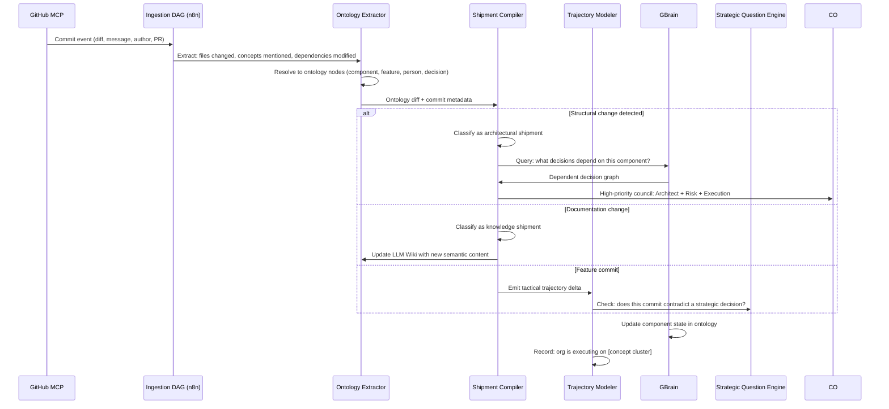
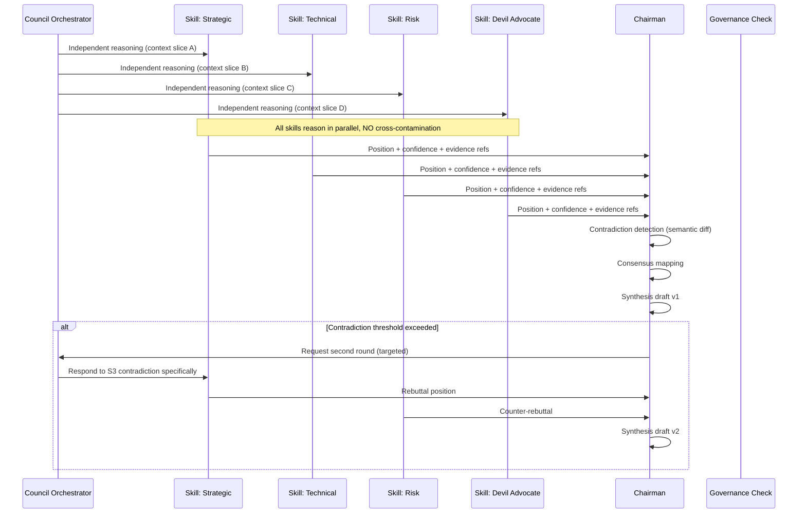
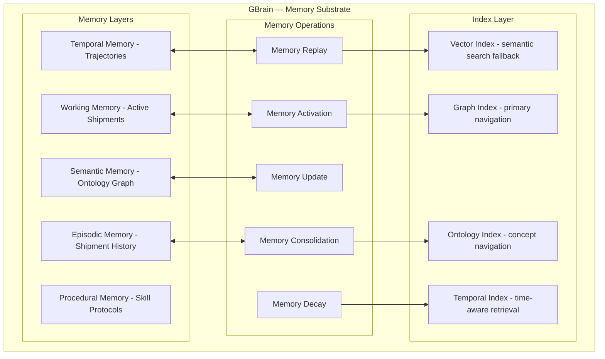
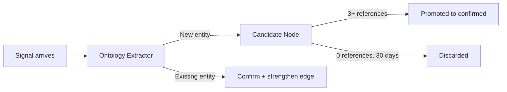

# OCR Agents Architecture

## Purpose

This document captures the architecture of the Organizational Cognition Runtime (OCR) and the agent-level design implied by the workspace documentation and diagrams.

It is built from:
- `ocr_kimi_2.6_raw_1.md`
- local architecture diagrams in `raw/images`
- web search context for related cognitive/runtime architectures

> **🗺️ City Map:** See [`CITY_MAP.md`](CITY_MAP.md) for the complete district atlas — every directory's purpose, blast radius, transit lines, and naming conventions. `_index.md` files in each directory are the neighborhood signposts.

## High-level design

OCR is not a generic agent platform. It is an organizational intelligence runtime built around:
- **Shipments** as atomic organizational actions
- **Ontology** as the shared cognitive substrate
- **GBrain** as the live memory substrate
- **Councils** as structured deliberation
- **Trajectories** as decision history and future-state modeling

The system is organized into these major layers:

1. Ingestion
2. Shipment compilation
3. Cognition runtime
4. Memory substrate
5. Governance and auditability
6. Executive surfaces

## Architecture overview



## Deployment architecture

The current design is centered on a single-node VPS bootstrap with these core services:
- `n8n` orchestration fabric
- `FastAPI` OCR API
- `WebSocket` executive surface live updates
- `Keycloak OSS` authentication
- `Ollama` OSS LLM host
- `PostgreSQL` for audit / shipment / ontology state
- `Neo4j CE` for graph-based ontology and decision navigation
- `Redis` working memory cache
- `Obsidian Vault sync`
- `Playwright` browser automation (Chromium headless)
- `Firecrawl` cloud scraping API
- Persistent volumes with nightly S3-compatible backups

## Ingestion and signal flow

Signals arrive from repository events, Obsidian notes, LLM wiki, external APIs, and **web scraping** (documentation, articles, research). They are normalized into OCR events and routed through `n8n`.

Web scraping uses an intelligent **ScraperRouter** that automatically picks between:
- **Firecrawl** — cloud API, clean markdown output, fast (~2s), best for documentation sites and articles
- **Playwright** — local browser, handles anything a real browser can (~5s), best for interactive pages, SPAs, and login walls

The router checks URL patterns first, defaults to Firecrawl, checks content quality, and falls back to Playwright if the content is blocked or empty.

Important constraints:
- `n8n` is orchestration fabric only — no cognitive logic belongs in DAGs
- Event signing and rate limiting protect ingestion
- Scope checks quarantine out-of-manifest repositories
- PII / secrets are stripped before normalization

### Example commit pipeline



## Cognitive activation and agents

OCR routes shipments into a council using an activation engine that computes:

```text
ActivationScore(skill, shipment) =
    w1 * OntologyOverlap(skill.jurisdiction, shipment.entities) +
    w2 * TrajectoryRelevance(skill.history, shipment.trajectory) +
    w3 * CouncilBalance(current_council, skill.perspective) +
    w4 * PriorContribution(skill.id, similar_shipments)
```

Key activation principles:
- `OntologyOverlap` ensures domain relevance
- `TrajectoryRelevance` ensures historical context
- `CouncilBalance` prevents echo chambers by boosting missing perspectives
- `PriorContribution` rewards skills with relevant past input

### Skill runtime

The skill registry can include roles such as:
- Strategic Analyst
- Technical Architect
- Risk Assessor
- Customer Advocate
- Financial Modeler
- Execution Tracker
- Ontologist
- Devil Advocate

Skills execute in parallel threads with isolated context slices. The chairman only receives position summaries, not raw internal reasoning.

## Council deliberation

Deliberation is a structured protocol with independent reasoning and synthesis.



### Governance outcomes

Council synthesis is validated before commit:
- `Validated` → commit to GBrain and surface to executives
- `HumanReview` → executive input requested
- `Rejected` → audit log entry and flag

Governance rules include:
- No orphan decisions
- Explainability before commitment
- Backward lineage for every decision

## GBrain memory substrate

GBrain is intentionally not a vector store. It is a cognitive state engine with layered memory, operations, and indexed navigation.



### Activation protocol

When a shipment arrives, the memory activation protocol is:
1. Ontology Anchor: resolve named entities to graph nodes
2. Trajectory Walk: trace 3–5 prior decision steps
3. Contradiction Surface: locate contradicting or superseding edges
4. Recency Decay: weight recent decisions higher while preserving old lore
5. Confidence Propagation: degrade confidence through relays

## Ontology architecture

The ontology is the shared backbone with:
- Core concepts: Products, People/Roles, Platform Components, Decisions, Objectives, Risks, Dependencies
- Relation types: owns, blocks, enables, contradicts, supersedes, depends_on, evolved_from, aligns_with, threatens
- Meta properties: temporal versions, confidence scores, source citations, author attribution

Ontology evolution follows:
- Shipment-driven promotion of candidate nodes
- Contradiction-driven refinement and concept splitting
- Dormancy and archival for low-use concepts
- Executive-origin injection with higher scrutiny



## Executive surfaces and outputs

OCR surfaces cognition through:
- Executive dashboard and live updates
- Strategic question engine
- Cognition log
- Podcast-style audio summarization
- Trajectory browser and decision timeline

## Governance and auditability

The audit layer is append-only with:
- shipment snapshots
- context window snapshots
- council input snapshots
- chairman synthesis versions
- governance decisions

Replay manager enables:
- audit reviews
- counterfactual comparison
- training / debugging

Governance also includes:
- policy engine for scope, council composition, escalation, data residency, human-in-loop
- access controls for roles, tenants, skills, and memory tiers

## Web search context

Web results confirm OCR is aligned with broader cognitive/runtime patterns such as:
- governed cognitive runtimes
- artifact-centric cognitive execution
- layered memory architectures
- explicit audit and policy control
- cognitive mesh / enterprise cognitive architecture

Examples found in search results:
- Dexter — Governed Cognitive Runtime Research
- Cognitive Runtime (structured AI runtime)
- Cognitive Mesh Architecture
- Layered Cognitive Architecture for organizational cognition

## Web scraping

OCR ingests web content through an intelligent two-tier scraper:

| Tool | Role | Latency | Best for |
|------|------|---------|----------|
| **Firecrawl** | Cloud scraping API | ~2s | Documentation, articles, static pages |
| **Playwright** | Local headless browser | ~5s | SPAs, login walls, interactive pages |

The **ScraperRouter** (`ingestion/web/scraper.py`) checks URL patterns first,
defaults to Firecrawl, validates content quality, and falls back to Playwright
when return content is empty, blocked, or boilerplate-only.

See `docs/ingestion/scraper.md` for the full routing design and
`docs/ingestion/browser-automation-mcp.md` for the landscape comparison.

The Firecrawl usage reference skill is at `~/.claude/skills/firecrawl/SKILL.md`
(Python SDK patterns, CLI commands, and OCR integration notes).

## Notes

This document is a workspace-level architecture summary and agent design guide. It is intended to be the reference for implementing or extending the OCR runtime.
