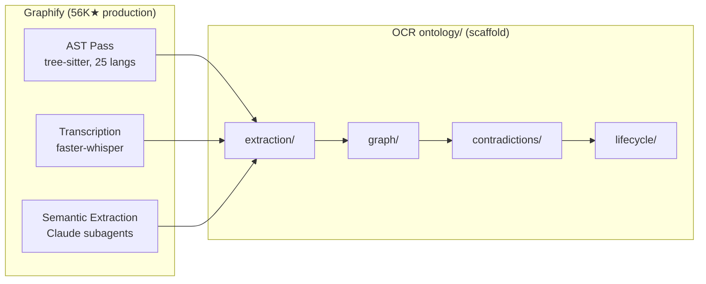

# OCR Architecture Synthesis

**Silver-layer cross-referencing.** Reads from all Bronze sources, produces
codified decisions for Gold (`docs/adrs/`, `_index.md` files, `AGENTS.md`).
Per Medallion architecture: Bronze (immutable sources) → Silver (synthesis) →
Gold (consumption decisions).

**Bronze sources cross-referenced:**
- `raw/bronze-docs/youtube/<channel>/` — YouTube video analyses (Nick Nisi, Matt Pocock, Luke Alvoeiro, Patrick Debois, Dex Horthy, Andrej Karpathy, Boris Cherny, Phil Hetzel, Daniel Zook, future)
- `raw/images/` — Architecture diagrams (01_system_overview → 24_roadmap_gantt)
- `raw/skills/` — Skill templates (reframed as gotchas per Nick Nisi analysis)
- `raw/bronze-docs/documentation/` — Scraped service documentation (opencode, future firecrawl, n8n, neo4j)
- `raw/bronze-docs/` (root) — Other reference material (ocr_kimi_2.6_raw_1.md, schemas, etc.)

---

## Medallion Architecture Overlay

Medallion Architecture (from data engineering: Bronze → Silver → Gold) maps naturally
onto OCR's directory structure and data flow. The existing codebase already follows
this pattern implicitly — naming it makes the gates explicit.

### The Three Layers

```
BRONZE (raw, immutable)    SILVER (enriched, validated)    GOLD (consumption)
─────────────────────────  ─────────────────────────────  ─────────────────────
Everything dumped as-is.   Cleaned, processed, decided.   What humans consume.

Append-only. No edits.     Gates at every transition.     Verified, proven,
Source of truth origin.    Development happens here.      auditable.
```

### Reality Check

The Medallion mapping describes **intention, not current reality.** A file-level audit
(June 2026) found:

| Layer | Directories | Actually Built |
|-------|-------------|----------------|
| **Bronze** | 7 | `ingestion/web/` + `tests/` are real. 4 of 7 ingestion subdirs empty. `raw/` has 481 files but they're reference docs and vendor skills, not OCR runtime data. |
| **Silver** | 11 dirs, 21 subdirs | **Zero.** Shipments, Cognition, Ontology, GBrain, Orchestration are completely empty scaffolds (only `_index.md`). Ledger has 2 SQL files. Agents has 2 thin stubs. Infra has Docker + nginx. One script. |
| **Gold** | 3 dirs, 6 subdirs | One HTML dashboard file (972 lines). Replay and observability are empty. |

**85-90% of the architecture is aspirational.** The directory structure and signposts
are meticulously pre-created. The web ingestion pipeline (ScraperRouter + Firecrawl +
Playwright) is genuinely working. Everything else — the core cognitive runtime — is a
blueprint waiting for implementation. The Medallion overlay remains useful as a
**roadmap**, not a description.

### OCR Directory Mapping

```
BRONZE                           SILVER                               GOLD
──────                           ──────                               ────
raw/bronze-docs/          ──────┐      shipments/compiler/                  surfaces/executive/
raw/images/              │      shipments/validator/                  surfaces/ontology/
raw/skills/              │      shipments/storage/                    surfaces/replay/
                         │      shipments/schemas/                    surfaces/shipments/
ingestion/github/  ─────┤      shipments/replay/                     replay/
ingestion/web/          ├────▶ cognition/councils/                   observability/logs/
ingestion/obsidian/     │      cognition/chairman/                    observability/metrics/
ingestion/filesystem/   │      cognition/governance/                  observability/traces/
ingestion/manual/       │      cognition/skills/                     observability/audits/
                         │      ontology/extraction/                  ────
tests/                  │      ontology/contradictions/               CONSUMPTION LAYER
                         │      ontology/graph/                       Human-facing output.
                         │      ontology/lifecycle/                   Verified by gates.
                         │      gbrain/activation/                    Audit-ready.
                         │      gbrain/episodic/
                         │      gbrain/semantic/
                         │      gbrain/temporal/
                         │      gbrain/replay/
                         │      orchestration/dags/
                         │      orchestration/triggers/
                         │      orchestration/n8n/
                         │      ledger/                            (spans Silver + Gold —
                         │      docs/                                written in Silver,
                         │      agents/                              read in Gold)
                         │      infra/
                         │      scripts/
                         │      src/api/
                         │      src/routers/
                         │      ────
                         │      DEVELOPMENT LAYER
                         │      Processing happens here.
                         │      Enriched, validated, governed.
```

### Gates Between Layers

Nick Nisi's key insight — **gates matter more than agents** — maps directly to
the Medallion transitions:

```
BRONZE ──[gate: normalize + validate]──▶ SILVER ──[gate: govern + prove]──▶ GOLD
         ingestion/shipments gate         cognition/governance gate
         • Strip PII from raw events      • Validate against policy
         • Validate schema                • Check for contradictions
         • Resolve entities               • Require evidence (SHA, video)
         • Fail malformed signals         • Escalate if confidence low
```

Each gate is:
- Enforced by code (state machine in cognition/councils + governance/)
- Not negotiable by agents
- Measurable (pass/fail rate tracked in observability/)
- Auditable (logged in ledger/)

### Nick Nisi + Medallion + OCR: Combined Principles

| Principle | Nick Nisi | Medallion | OCR Implementation |
|-----------|-----------|-----------|-------------------|
| Gates > agents | State machine enforces transitions | Layer transitions have validation gates | cognition/governance validates before commit; n8n enforces DAG order |
| Prove it, don't promise | SHA-256 test output, Playwright video | Gold requires proof of Silver processing quality | Replay manager + ledger provide cryptographic audit trail |
| Gotchas not docs | 553 lines of gotchas beat 10K lines of doc skills | Skills at each layer transition prevent known failure modes | Reframe raw/skills/ as gotcha files, not comprehensive references |
| Fix the harness | Every agent failure is a harness bug | Broken Silver→Gold gate → fix the gate, not the data | ontology/contradictions + gbrain/replay identify and fix systemic issues |
| Measure or you're guessing | Evals showed skills were hurting | Measure quality at each layer transition | observability/ + replay/ provide measurement infrastructure |
| Memory learns | Retro agent writes back to memory files | Bronze feeds Silver feeds Gold feeds memory | gbrain/episodic → retro → gbrain/semantic → better decisions |

### Practical Implications for OCR

1. **raw/ stays as Bronze** — append-only, never edit. `raw/bronze-docs/`, `raw/images/`,
   `raw/skills/` are the immutable source of truth. New material gets added, never
   modified in place. If something needs cleaning, it moves to Silver (docs/).

2. **skills become gotchas** — the 17 skill templates in `raw/skills/` should be
   reframed from comprehensive reference → 3-5 gotchas each. Nick Nisi's data
   proves comprehensive skills degrade performance. The skill should say: "When
   working with X, watch out for Y." Not "Here is everything about X."

3. **governance is the Silver→Gold gate** — `cognition/governance/` is the most
   important directory in the system. It enforces: is the evidence real? Does
   the decision contradict past decisions? Is the confidence high enough? If not,
   reject back to Silver. This is the state machine Nick describes.

4. **evals need to exist** — we have no eval framework yet. The strategic question
   engine (`surfaces/executive/`) should be paired with an eval pipeline that:
   - Replays past decisions (replay/)
   - Compares outcomes with predictions
   - Updates ontology confidence scores
   - Reports degradation (observability/)

5. **wrap-around: Bronze teaches Gold** — when a Gold consumer (human) spots an
   error in a surfaced decision, that error feedback goes back to Bronze as new
   reference material. The lifecycle closes: Gold → Bronze → Silver → Gold.
   This is the learning loop.

### Final Mermaid

```mermaid
graph LR
    subgraph BRONZE["Bronze — Raw (Immutable)"]
        RD[raw/bronze-docs]
        RI[raw/images]
        RS[raw/skills]
        IG[ingestion/github]
        IW[ingestion/web]
        IO[ingestion/obsidian]
    end

    subgraph SILVER["Silver — Development (Enriched)"]
        SH[shipments/]
        CO[cognition/]
        ON[ontology/]
        GB[gbrain/]
        OR[orchestration/]
        LE[ledger/]
    end

    subgraph GOLD["Gold — Consumption (Verified)"]
        SE[surfaces/executive]
        SO[surfaces/ontology]
        RP[replay/]
        OB[observability/]
    end

    BRONZE -->|"Gate: normalize + validate"| SILVER
    SILVER -->|"Gate: govern + prove"| GOLD
    GOLD -->|"Feedback: error → new raw"| BRONZE
```



The system is only as good as its gates. Not its agents. Not its prompts. Its gates.

---

## LLM Wiki Pattern — Karpathy's Three-Layer Knowledge Base

Andrej Karpathy released the **LLM Wiki** pattern in April 2026. It has since
spawned multiple implementations (nvk/llm-wiki 467★, Pratiyush/llm-wiki 252★,
domleca/llm-wiki 154★). The pattern is directly relevant to OCR's ontology/
and gbrain/ layers.

### The Three Layers

1. **Raw sources** (`raw/`) — immutable. Session transcripts, articles, papers.
   Never modified.
2. **The wiki** (`wiki/`) — LLM-generated. One page per entity, concept, source.
   Interlinked via `[[wikilinks]]`. The LLM owns this layer entirely — it creates,
   updates, cross-references, and keeps everything consistent.
3. **The schema** (`CLAUDE.md`, `AGENTS.md`) — tells the agent how the wiki is
   structured, what conventions to follow, what workflows to use.

Key operations:
- **Ingest**: Drop a source → LLM reads it + existing wiki, writes new pages,
  updates older pages where context shifts, refreshes index, logs the change.
  Each ingest is a *refactor pass*, not an append.
- **Query**: Search the wiki, synthesize answers with citations. Good answers
  get filed back as new wiki pages.
- **Lint**: Two-pass health check — local scan (broken links, orphans) + LLM pass
  (contradictions, gaps, stale claims).

### Relevance to OCR

OCR's `ontology/` directory is currently empty scaffolding. The LLM Wiki pattern
is exactly what should go there:

| OCR Directory | LLM Wiki Equivalent | Pattern |
|---------------|-------------------|---------|
| `ontology/extraction/` | Ingest step | Read source → extract entities, concepts, relationships |
| `ontology/graph/` | Wiki layer | Interlinked markdown pages per entity/concept |
| `ontology/contradictions/` | Lint step | Detect contradictions, gaps, stale claims |
| `ontology/lifecycle/` | Update protocol | Candidate → confirmed → dormant → archived |
| `gbrain/semantic/` | Query step | Search the graph, synthesize answers |

A key difference: the LLM Wiki is built **by an LLM from raw sources**. OCR's
ontology should do the same — not from raw text, but from shipments passing
through the cognition pipeline. Every shipment carries entities; the ontology
extraction component should integrate them into the existing graph, update
relevant pages, flag contradictions, and note what changed.

Graphify (see below) is the codebase-scale version of the same idea.

---

## Graphify — Knowledge Graph from Any Codebase

**safishamsi/graphify** (56K★ on GitHub, April 2026) turns any folder of code,
docs, PDFs, images, or videos into a queryable knowledge graph. It ships as a
skill for Claude Code, Codex, OpenCode, Cursor, Gemini CLI, and 14+ other agents.

### How It Works

Three passes:

1. **AST pass** (deterministic, no LLM): Extracts structure from code files —
   classes, functions, imports, call graphs, docstrings, rationale comments.
   Uses tree-sitter for 25 languages.
2. **Transcription** (local, no cloud): Video/audio transcribed with
   faster-whisper using a domain-aware prompt derived from corpus "god nodes."
3. **Semantic extraction** (LLM subagents): Claude agents run in parallel over
   docs, papers, images, transcripts to extract concepts, relationships, design
   rationale.

Output: NetworkX graph → Leiden community detection → interactive HTML +
queryable JSON + plain-language GRAPH_REPORT.md.

### Relevance to OCR

Graphify is a reference implementation for everything `ontology/` should do:



Graphify's `--wiki` flag generates Wikipedia-style markdown articles per
community with an `index.md` entry point — exactly the pattern OCR's
`gbrain/semantic/` should implement. And Graphify's MCP server for querying
the graph is what OCR's `ontology/graph/` should become.

### Key Difference

Graphify runs on demand when you type `/graphify`. OCR's ontology runs
**continuously** — every shipment that passes through cognition updates the
graph. Graphify is a snapshot; OCR is a live substrate. This makes OCR harder,
but also more powerful: the graph doesn't need to be rebuilt from scratch —
it's always current.

---

## Evals as ETL Pipelines — Measuring OCR

Nick Nisi's core finding: he only discovered his skills were degrading
performance (77% → 97% by removing them) because he **measured it**. Without
evals, you cannot tell if you're helping or hurting.

The web search found three relevant eval frameworks:

| Framework | Approach | Best For |
|-----------|----------|----------|
| **AgentEval** | DAG-structured step-level eval. LLM-as-judge with calibration anchors. Taxonomy-first failure classification. | Complex multi-step agents where failures propagate. |
| **agentevals** | OTel trace-based. Score from existing traces without re-execution. Golden eval sets. Local-first, CI/CD ready. | Lightweight, framework-agnostic. Works with any agent that emits OTel. |
| **eval-harness** | Config-driven YAML. 13 built-in evaluators. A/B variants. Drift detection. | Production CI/CD. Most mature ecosystem. |

### Proposed: OCR Eval Pipeline as ETL

Nick Nisi's approach maps directly to ETL architecture:

```
EXTRACT                          TRANSFORM                          LOAD
───────                          ─────────                          ────

[replay/]                      [cognition/ pipeline]              [observability/]
golden shipments                feed through current                store results
from past runs                  councils + chairman                 keyed by trace_id

[ledger/]                      [ontology/ resolution]             [surfaces/executive]
expected outcomes               compare entity extraction           alert on degradation

[surfaces/executive]           [gbrain/ memory]                    [ledger/]
eval configuration              replay memory activation            commit eval audit trail
```

**Step by step:**

1. **Extract** — Pull historical shipments from `replay/`. Each shipment has:
   - Input signal (the raw event)
   - Expected decision (what the council should conclude)
   - Expected confidence score
   - Expected ontology changes

2. **Transform** — Feed each case through the CURRENT pipeline:
   - `shipments/compiler/` → compile the shipment
   - `cognition/councils/` → run council deliberation
   - `cognition/chairman/` → synthesize
   - `cognition/governance/` → validate
   - Record full trace: skill activations, positions, synthesis, gate decisions
   - Store each trace as OTel spans (compatible with agentevals) or JSONL

3. **Load** — Compare current outcome with expected outcome:
   - Decision match? (pass/fail)
   - Confidence delta? (regression if lower)
   - Ontology impact? (unexpected changes?)
   - Latency regression? (slower than baseline?)
   - Store results in `observability/` — four fact tables keyed by trace_id:
     - `traces` — the OTel spans of every eval run
     - `eval_scores` — rubric verdicts per step and per trace
     - `cost` — token consumption per run
     - `outcome` — resolved vs degraded vs failed

### An Eval Run (Nick Nisi Style)

```
Scenario: "Install AuthKit into a TanStack Start project"

Run A: WITHOUT skills loaded
  → Feed through standard council
  → Record decision + confidence + outcome
  → Baseline: 97% pass rate

Run B: WITH skills loaded (the 10K-line comprehensive docs)
  → Feed through standard council (plus skill context)
  → Record decision + confidence + outcome
  → Variant: 77% pass rate
  → **Degradation detected. Skills are hurting.**

Run C: WITH gotcha skills loaded (553 lines of common failure modes)
  → Feed through standard council (plus gotcha context)
  → Record decision + confidence + outcome
  → Variant: 96% pass rate
  → **Improvement confirmed. But only because we measured.**
```

### CI/CD Integration

Following eval-harness's pattern:

```yaml
# .github/workflows/ocr-eval.yml
on: [pull_request]
jobs:
  eval:
    runs-on: ubuntu-latest
    steps:
      - run: ocr eval run --suite shipment-regression
      - run: ocr eval compare --baseline main --head $PR_BRANCH
      - run: ocr eval drift --exit-nonzero-on-regression
      - uses: ocr/eval-comment@v1  # post results to PR
```

### The Hard Part: Building the Golden Dataset

Before evals can run, we need a golden dataset of known-good decisions. Since
85% of the system is still scaffold, the golden dataset doesn't exist yet.

**Strategy:** Bootstrap from the small real footprint:
1. The web ingestion pipeline works — capture real web scrapes as eval cases
2. The executive dashboard exists — manually curate expected outputs
3. As each Silver component gets built (shipments first, then cognition, etc.),
   capture its decisions as golden cases in `ledger/`
4. Every new component gets built with its eval cases as a precondition —
   "build it, then prove it works"

This is Nick Nisi's lesson 5 ("fix the harness, not the code") applied at the
system level: don't build the whole system and then add evals. Build evals
first, then build the system to pass them.

---

## Summary: The Eight Voices

| Thread | Core Insight | OCR Impact |
|--------|-------------|------------|
| **Nick Nisi** | Gates over agents. Prove it, don't promise. Fix the harness. | cognition/governance/ is the most important directory. Skills should be gotchas. See `raw/bronze-docs/youtube/AI_Engineer/nick_nisi_building_ai_systems_that_ship.md`. |
| **Medallion** | Bronze→Silver→Gold with enforced transitions | Directory structure already maps to layers. 85% of Silver and Gold are still scaffold. |
| **LLM Wiki** | LLM maintains a persistent, compounding knowledge base | ontology/ + gbrain/ should implement Karpathy's three-layer pattern |
| **Graphify** | AST + LLM → knowledge graph from any codebase | Reference implementation for ontology/extraction/ + ontology/graph/ |
| **Evals as ETL** | Extract past cases → run through pipeline → compare outcomes. Measure or guess. Eval maturity continuum: human annotation → LLM-as-judge → multi-step trace eval → automated failure discovery. Eval flywheel: capture production traces → identify failures → offline eval → improve. Stateful evals are the hardest unsolved problem. | Need a golden dataset. Build evals before building the rest of the system. Start with human annotation (Level 1), not automated evals. The eval flywheel is OCR's learning loop. See `raw/bronze-docs/youtube/AI_Engineer/phil_hetzel_eval_maturity_for_agents.md`. |
| **Matt Pocock** | Smart zone ~100K tokens. Grill Me for alignment. Ubiquitous Language for shared vocabulary. Rate of feedback = speed limit (TDD). Deep modules, design interface/delegate implementation. Code is NOT cheap — bad code is the most expensive it's ever been. | Council deliberation = Grill Me + Ubiquitous Language. Shipments = vertical slices. Eval pipeline = TDD (small steps, immediate feedback). ontology/extraction/ = shared vocabulary. Governance gate = design investment (anti-entropy). See `raw/bronze-docs/youtube/AI_Engineer/matt_pocock_building_ai_systems_that_ship.md`. |
| **Factory Missions** | Orchestrator/worker/validator with validation contracts. Serial execution beats parallel. Right model per role. Thin deterministic logic. | Council/worker/governance maps directly. Serial shipment processing (overrides Kanban DAG). Eval pipeline = validation contract. Model-agnostic per role. See `raw/bronze-docs/youtube/AI_Engineer/luke_alvoeiro_factory_missions_multi_agent_architecture.md`. |
| **CDLC (Patrick Debois)** | Context is the new code. Context needs a full lifecycle: Generate → Evaluate → Distribute → Observe → Adapt. Layered non-deterministic testing with error budgets. Skills as packages with SBOM. Context filters for security. | CDLC maps to Medallion. Error budget model for evals (run 5x, track rate). AI SBOM for skills. Context filter in governance. Production feedback loop generates eval cases. See `raw/bronze-docs/youtube/AI_Engineer/patrick_debois_context_is_the_new_code.md`. |
| **Context Engineering (Dex Horthy)** | RPI (Research→Plan→Implement) as context window management. Dumb zone at ~40%. Intentional compaction at every stage. Sub-agents are for context, not roles. Don't outsource the thinking. Mental alignment through plan review. | RPI maps to OCR pipeline (compile→council→governance). Each gate is a compaction point. Skills are contextual sub-agents. Governance gates plan reviews for org-scale alignment. Trajectory matters — design deliberation for positive trajectory. See `raw/bronze-docs/youtube/AI_Engineer/dex_horthy_advanced_context_engineering.md`. |
| **Karpathy / Software 3.0** | Paradigm shift: programming is now managing context. Vibe coding (floor) vs agentic engineering (quality bar). Jagged intelligence — models are not uniformly capable. Verifiability determines automation speed. Ghosts > animals framing. Understanding is the bottleneck. | Theoretical foundation for OCR's existence. Jagged intelligence proves gates are necessary. Vibe coding vs agentic engineering validates quality bar. LLM Wiki is the ontology reference. Understanding bottleneck validates ontology as organizational understanding layer. See `raw/bronze-docs/youtube/Sequoia_Capital/andrej_karpathy_vibe_coding_to_agentic_engineering.md`. |
| **Boris Cherny / Claude Code** | Creator of Claude Code — coding is solved (100% AI-generated codebase). Product overhang thesis: build for next model. Loops and routines as first-class primitives. Org process > technology. Claude-to-Claude communication. Everyone codes. | Loops = OCR pipeline runner. Product overhang validates ADR-0006 (build for future model). Org process > technology validates OCR's entire premise. Claude-to-Claude validates council/chairman pattern. Harness importance diminishing over time means build gates NOW. See `raw/bronze-docs/youtube/Sequoia_Capital/boris_cherny_claude_code_and_the_future_of_software.md`. |

The unifying thread: **build the gates, not the agents. Measure everything.
Never trust — always verify. Context needs the same discipline as code.
Context engineering is the technical practice that makes the rest possible.
The paradigm has shifted — adapt or produce slop.
The organizations that adapt their process win, not the ones with the best model.**

---

## Architecture Validation: 10 Production Use Cases

Web search (June 2026) confirmed the Bronze→Silver→Gold + multi-agent pattern
across these production deployments:

| # | Use Case | Who | Pattern |
|---|----------|-----|---------|
| 1 | **IT Support Knowledge Base** | ameau01/llm-wiki-knowledge-engine | Three-layer retrieval: raw vector → LLM Wiki → Knowledge Graph over 745 tickets |
| 2 | **Personal Second Brain** | Karpathy (original), claude-obsidian | raw/ → wiki/ → schema/ for research, reading, goals |
| 3 | **Enterprise Knowledge Hub (MCP)** | Arkon (BrilliantCompany/llm-kb) | Compiles SOPs/policies → structured wiki → serves via MCP with RBAC |
| 4 | **Autonomous SDLC (16-day missions)** | Factory Missions | Orchestrator/worker/validator for full-stack dev, migrations, prototypes |
| 5 | **Customer Service Routing** | Wells Fargo / beam.ai | Orchestrator routes to billing/tech/product specialists. 35K bankers, 1700 procedures |
| 6 | **Contract Generation Pipeline** | Microsoft Azure Architecture Center | Sequential: template → clause → compliance → risk assessment |
| 7 | **Factory Operations (NVIDIA FOX)** | Foxconn, Pegatron, Advantech | Factory manager agent orchestrates QC, material transport, safety agents |
| 8 | **SRE Incident Response** | Microsoft / adaptive planning | Manager agent dynamically builds plan, pivots on new diagnostic info |
| 9 | **Document Processing Pipeline** | Multi-agent sequential | Parse → extract → validate → summarize per stage |
| 10 | **Multi-Perspective Financial Analysis** | Fan-out/fan-in | Fundamental, technical, sentiment, ESG agents in parallel, aggregate via voting |

**Key finding**: Every production use case separates raw sources (Bronze) from
compiled knowledge (Silver) from consumption decisions (Gold). No production
system runs agents directly against raw data — they always insert a compilation/
curation layer. This validates the Architecture Synthesis pattern.

---

## Critical Design Correction: Serial Over Parallel

**Factory's production data disproves the Kanban DAG pattern for agent execution.**

Matt Pocock advocated a Kanban board DAG where multiple agents work on independent
issues in parallel. Factory tried this and it failed in production:
- Agents conflict and step on each other's changes
- Work gets duplicated
- Architectural decisions become inconsistent
- Coordination overhead eats speed gains AND burns tokens

**Missions runs features serially** — one worker or validator at any point in time.
Parallelism is only used within read-only operations (searching codebase, researching
APIs, code review).

**For OCR this means:** shipments should be processed serially through the council →
worker → governance pipeline. Parallelize only within read-only scopes (research
sub-agents, independent code review). The Kanban DAG remains useful as a *human-level
task tracking* tool, not an *agent-level execution* strategy.

The Medallion gate architecture naturally enforces this: gates serialize at the
transition points, giving fresh context to each subsequent stage.


