Layer	What it selects	Token budget

Ontological Core	The entities directly named in the shipment, their first-order relations	20%

Trajectory Context	Recent decisions on the same trajectory path	30%

Contradicting Evidence	Memory fragments that oppose the current signal	15%

Skill Prerequisites	What the assigned skills need to reason well	20%

Headroom	Reserved for council synthesis expansion	15%Component	Cost

VPS (8 core, 32GB, 500GB NVMe)	~$40-80/month

OSS LLM (Llama 3 8B on-device)	$0 extra

n8n (self-hosted)	$0

Neo4j Community Edition	$0

PostgreSQL	$0

Obsidian + plugin	~$10/month

Total	~$50-100/month# Organizational Cognition Runtime — Principal Architecture Document


> *Reasoning from first principles. This is not a generic agent platform. This is persistent organizational intelligence infrastructure.*


---


## Foundational Philosophy


Before touching a single diagram, the intellectual frame must be correct.


**Generic agent platforms** route tasks to LLMs and call it intelligence. That produces ephemeral, unreliable, unauditable noise.


**Organizational Cognition Runtime (OCR)** is different. It treats the organization as a *cognitive entity* with:

- **Memory** that persists and evolves (not RAG over docs)

- **Ontology** that represents what the org *knows it knows*

- **Shipments** as the atomic unit of intentional organizational action

- **Councils** as structured deliberation — not round-robin prompting

- **GBrain** as the live memory substrate — not a vector store

- **Trajectories** as the organization's path through decision space over time


The moat is **not the LLM**. The moat is the **accumulated, structured, replayable cognitive history** of the organization.


---


## Part I — System Overview Architecture


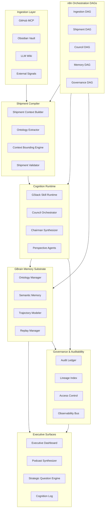


---


## Part II — Cognition Runtime Architecture (Deep)


The Cognition Runtime is the *brain* of OCR. It is not a pipeline. It is a **state machine with deliberative capacity**.


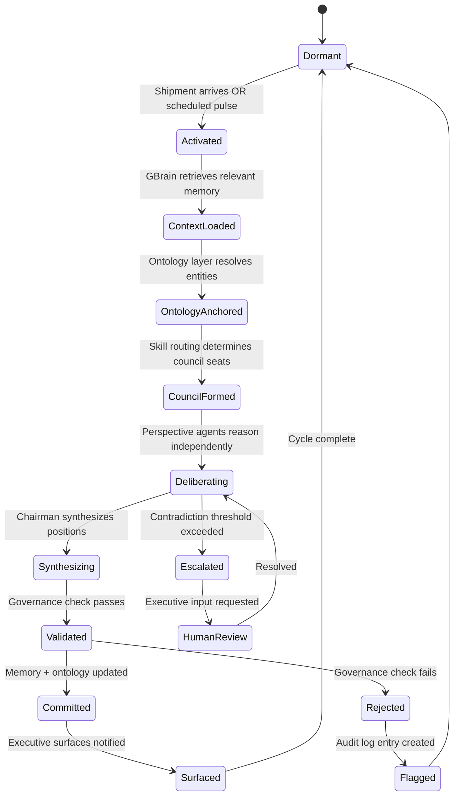


### Key Insight on the Runtime State Machine


The runtime **never executes blindly**. Every state transition is:

1. Logged to the Audit Ledger

2. Tagged with the triggering Shipment ID

3. Reversible (via Replay Manager)

4. Ontology-anchored (entities are resolved before deliberation begins)


This is what separates OCR from "n8n with GPT-4 nodes."


---


## Part III — Shipment Architecture


### What is a Shipment?


A **Shipment** is the atomic unit of intentional organizational cognition. It is NOT a task, a prompt, or a workflow. It is a **bounded cognitive event** with:


- A **declared intent** (what is this trying to accomplish?)

- A **context window** (what organizational knowledge is relevant?)

- A **council assignment** (which perspectives must reason about this?)

- A **commitment record** (what was decided and why?)

- A **trajectory delta** (how did this change the org's cognitive state?)


### Shipment Lifecycle


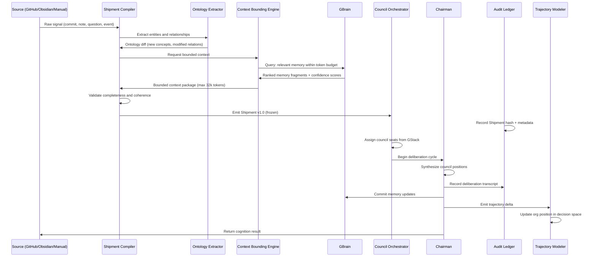


### Shipment Context Window Bounding (Q2)


The context window bounding problem is **the hardest engineering problem in OCR**. Generic RAG fails here because it optimizes for similarity, not for *cognitive relevance*.


**The Context Bounding Engine uses a 4-layer relevance model:**


| Layer | What it selects | Token budget |

|---|---|---|

| **Ontological Core** | The entities directly named in the shipment, their first-order relations | 20% |

| **Trajectory Context** | Recent decisions on the same trajectory path | 30% |

| **Contradicting Evidence** | Memory fragments that *oppose* the current signal | 15% |

| **Skill Prerequisites** | What the assigned skills need to reason well | 20% |

| **Headroom** | Reserved for council synthesis expansion | 15% |


**Why contradicting evidence gets its own budget:** Organizations consistently make bad decisions because dissenting signals are under-weighted in context. Building contradiction into the context window is a first-principles structural guarantee against groupthink.


---


## Part IV — GStack Skill Activation Runtime (Q1)


### What is GStack?


GStack is the **skill registry and activation runtime** of OCR. Skills are not prompts. Skills are **cognitive roles** with:

- A declared **perspective** (what angle do they reason from?)

- A **prerequisite ontology** (what concepts must be resolved before activation?)

- A **reasoning protocol** (chain-of-thought structure, not free-form)

- A **confidence signature** (how certain is this skill's output?)

- A **jurisdiction** (what types of shipments can this skill reason about?)


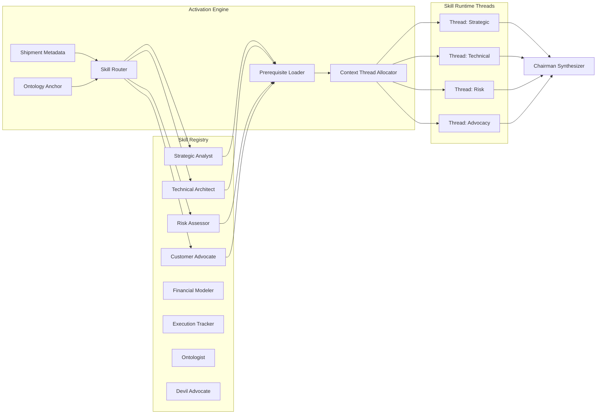


### Skill Activation Logic (Deep)


Skill activation is **not LLM-based routing** (which is flaky and ungovernable). It uses a **deterministic ontology-matching algorithm:**


```

ActivationScore(skill, shipment) =

    w1 * OntologyOverlap(skill.jurisdiction, shipment.entities) +

    w2 * TrajectoryRelevance(skill.history, shipment.trajectory) +

    w3 * CouncilBalance(current_council, skill.perspective) +

    w4 * PriorContribution(skill.id, similar_shipments)

```


**CouncilBalance is critical:** If the current council has 3 technical skills and 0 advocacy skills, the activation engine *forces* advocacy activation even if ontology overlap is low. This prevents echo chambers.


**Skills activate in parallel threads**, each with their own context slice. The Chairman does NOT see individual threads during deliberation — it only receives **position summaries** after independent reasoning completes. This enforces genuine deliberative independence.


---


## Part V — Council Architecture (Q3, Q4)


### Council Deliberation Protocol


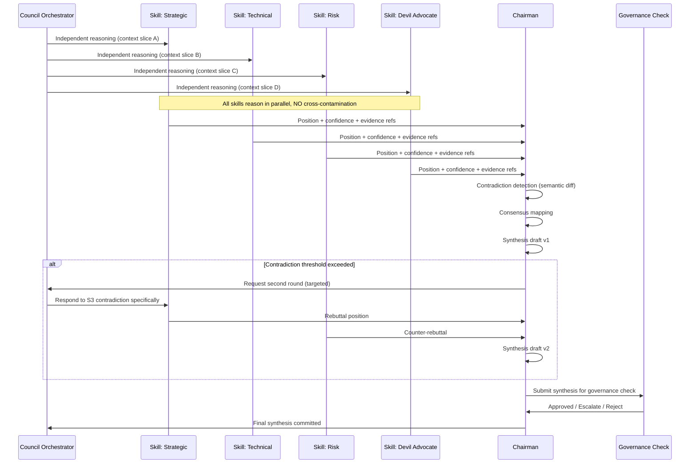


### Chairman Synthesis (Q4)


The Chairman is **not the smartest LLM**. The Chairman is a **structured synthesis protocol** running on a reasoning-capable OSS model.


Its job is strictly:

1. **Map convergence** — Where do skills agree? This becomes high-confidence output.

2. **Map divergence** — Where do skills disagree? This becomes the *strategic question* (not an error).

3. **Weight by evidence** — Skills that reference ontology-anchored evidence > skills reasoning abstractly.

4. **Preserve dissent** — The synthesis document always contains a "minority position" section. Dissent is organizational memory, not noise.

5. **Declare unknowns** — If no skill can resolve a contradiction, the Chairman declares an explicit *open question* and routes it to the Strategic Question Engine.


**Chairman Output Schema:**

```json

{

  "shipment_id": "SHP-2026-0847",

  "synthesis": {

    "consensus_positions": [...],

    "minority_positions": [...],

    "open_questions": [...],

    "confidence": 0.82,

    "evidence_references": ["ONT-042", "MEM-8821", "REPO-commit-a4f3"]

  },

  "trajectory_delta": {

    "affected_concepts": [...],

    "position_shift": "vector",

    "decision_type": "strategic | tactical | architectural | operational"

  },

  "governance": {

    "requires_human_review": false,

    "risk_flags": [],

    "audit_hash": "sha256:..."

  }

}

```


---


## Part VI — GBrain Memory Architecture (Q5, Q18)


### GBrain is NOT a Vector Store


This is the most important architectural distinction. A vector store does **semantic similarity retrieval**. GBrain does **cognitive state management**.


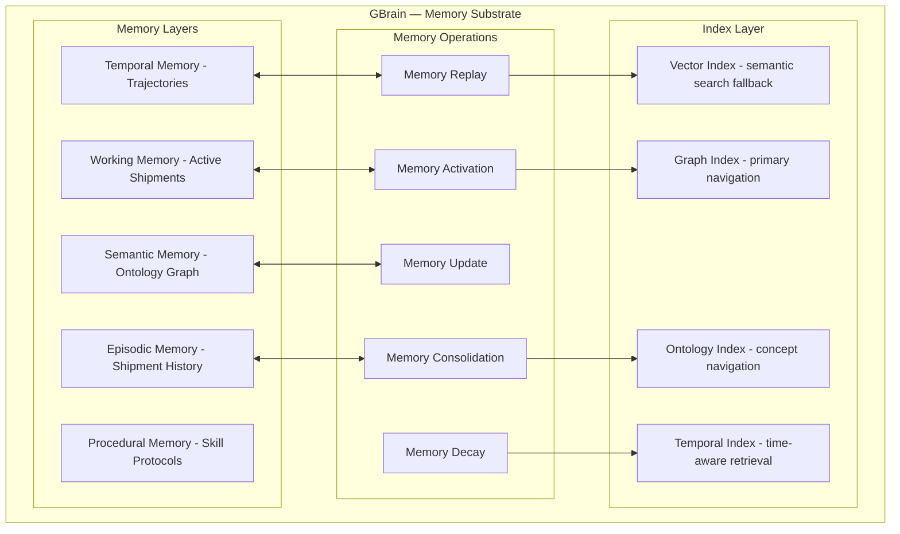


### Memory Activation Protocol (Q5)


When a Shipment arrives, GBrain doesn't "search" — it **activates**:


**Step 1 — Ontology Anchor**: Resolve all named entities to graph nodes. This is the primary activation signal.


**Step 2 — Trajectory Walk**: From each anchored node, walk the trajectory graph backward 3-5 decision steps. This surfaces *how we got here* automatically.


**Step 3 — Contradiction Surface**: Query the graph for edges of type `contradicts` or `supersedes` attached to activated nodes.


**Step 4 — Recency Decay**: Apply temporal decay to weight recent decisions more heavily, but *never discard* distant decisions — they become part of "organizational lore."


**Step 5 — Confidence Propagation**: Memory fragments carry confidence scores that degrade with each relay (episodic → semantic → procedural). This prevents "telephone game" distortion.


---


## Part VII — Ontology Architecture (Q6, Q17)


### Ontology is the Backbone, Not an Add-On


The ontology is the **shared cognitive substrate** of the entire organization. Without it, every LLM call is contextless. With it, every LLM call is anchored to the organization's actual world.


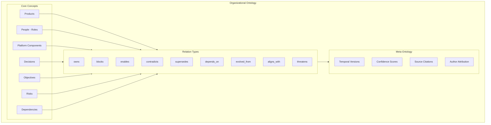


### Ontology Evolution Design (Q6)


Ontologies must evolve or they become stale organizational debt. OCR uses **4 evolution mechanisms**:


**1. Shipment-Driven Evolution**

Every committed Shipment runs through the Ontology Extractor. New entities are proposed as `candidate` nodes. After 3+ independent shipments reference the same candidate entity, it is promoted to `confirmed`. This prevents ontology pollution from one-off signals.


**2. Contradiction-Driven Refinement**

When a council deliberation surfaces a contradiction, the Ontologist skill examines whether the contradiction stems from *ontological ambiguity* (two different meanings for the same term). If so, it proposes a concept split.


**3. Decay and Archival**

Concepts not referenced in any Shipment for N days are flagged as `dormant`. Dormant concepts are archived (never deleted) and their relations are weakened. This keeps the active ontology relevant without losing history.


**4. Executive Injection**

Executives can directly inject new ontology concepts via the Executive Surface. These bypass the 3-shipment rule but are flagged as `executive-origin` and require higher council scrutiny when referenced.


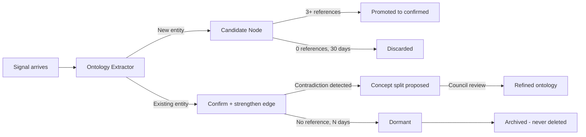


---


## Part VIII — Trajectory Modeling (Q7)


### Organizational Trajectories


A trajectory is the **path an organization has taken through its decision space**. Every committed Shipment emits a trajectory delta — a vector displacement in a high-dimensional concept space.


**This is not metaphorical.** Trajectories are stored as:

- A sequence of decision events tagged with timestamps and Shipment IDs

- A concept space representation (the set of active ontology nodes and their weights at each point in time)

- A **momentum vector** (the direction and velocity of recent decisions)

- **Branch points** (decisions where the council was split — these are high-value strategic memory)


```mermaid

graph LR

    T0[T0: Org State] --> D1[Decision: Platform v1]

    D1 --> T1[T1: Org State]

    T1 --> D2[Decision: API-first]

    T1 --> D2B[Decision: Monolith-first - NOT TAKEN]

    D2B -.->|counterfactual stored| CF[Counterfactual Branch]

    D2 --> T2[T2: Org State]

    T2 --> D3[Decision: OSS LLM adoption]

    D3 --> T3[T3: Org State - Current]

    T3 --> |momentum| PROJ[Projected trajectory]

    PROJ --> |uncertainty cone| FUT[Future Decision Space]



    style CF fill:#2d1b1b,stroke:#8b0000

    style PROJ fill:#1b2d1b,stroke:#006400

    style FUT fill:#1b1b2d,stroke:#000080

```


### Strategic Question Emergence (Q8)


Strategic questions are **not generated by asking an LLM "what should we think about?"** That produces generic noise.


Strategic questions *emerge* from trajectory analysis:


1. **Momentum Divergence**: When the trajectory momentum vector changes direction sharply (measured by cosine similarity of recent vs. historical trajectory deltas), the system emits a strategic question: *"Something is shifting — is this intentional?"*


2. **Unresolved Contradiction Accumulation**: When 3+ shipments in a time window all contain open questions on the same ontology cluster, the Strategic Question Engine consolidates them into one explicit strategic question surfaced to executives.


3. **Counterfactual Aging**: When a counterfactual branch (not-taken decision) reaches an age where its assumptions can now be tested against reality, the system surfaces it: *"We chose X over Y. Here's what Y would have looked like."*


4. **Trajectory-Ontology Mismatch**: When the org's stated objectives (in the ontology) diverge from the actual trajectory direction (measured by which concepts are most active in recent shipments), a strategic question is surfaced automatically.


---


## Part IX — Repo Changes and Organizational State (Q9)


### GitHub MCP → Org State Pipeline


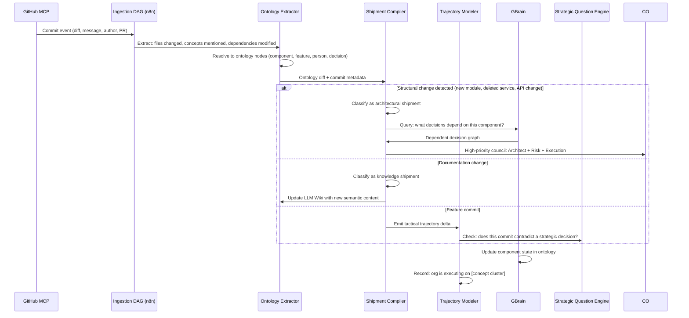


**Key insight:** Not every commit should trigger a full council. The Shipment Compiler uses a **significance classifier** (deterministic rules + lightweight LLM for edge cases) to route commits to:

- **Architectural Shipments** → Full council deliberation

- **Tactical Shipments** → Lightweight logging + ontology update

- **Knowledge Shipments** → Wiki + ontology update only

- **Signal Shipments** → Trajectory logging only


This keeps the system from drowning in noise.


---


## Part X — Executive Cognition Surfaces (Q10)


### What Executives Actually Need


Executives do not need dashboards with 47 metrics. They need:

1. **Where are we?** (current organizational state)

2. **How did we get here?** (trajectory with decision lineage)

3. **What is unresolved?** (open strategic questions)

4. **What should I decide?** (escalations requiring executive input)

5. **What did I decide before and how is it playing out?** (longitudinal accountability)


```mermaid

graph TB

    subgraph EXEC["Executive Cognition Surface"]

        subgraph NOW["Now View"]

            CS[Current State Snapshot]

            AQ[Active Questions]

            ES[Escalations Awaiting Input]

        end



        subgraph TRAJECTORY["Trajectory View"]

            DL[Decision Log - last 90 days]

            MM[Momentum Map - concept activity heatmap]

            CF[Counterfactual Browser]

        end



        subgraph DEEP["Deep Dive"]

            SR[Shipment Replay]

            CD[Council Deliberation Transcripts]

            OV[Ontology Visualizer]

        end



        subgraph AUDIO["Audio Synthesis"]

            PD[Weekly Cognition Podcast]

            BF[Decision Briefing]

        end

    end



    GB[GBrain] --> CS & DL & MM

    SQ[Strategic Questions] --> AQ

    GOV[Governance Layer] --> ES

    TM[Trajectory Model] --> CF & MM

    RM[Replay Manager] --> SR & CD

    OM[Ontology] --> OV

    CH[Chairman Transcripts] --> PD & BF

```


### Non-Technical Reasoning Surfaces


For executives who are not engineers, OCR surfaces cognition in **narrative form**, not data form:


- Every Shipment synthesis has a **plain-language executive summary** generated by a dedicated translation skill

- The Trajectory View shows decisions as **story arcs**, not graphs

- Strategic Questions are phrased as **genuine questions**, not metrics alerts

- The Podcast Synthesizer (Q11) converts weekly cognition into spoken narrative


---


## Part XI — Podcast / NotebookLM-Style Synthesis (Q11)


### How Cognition Becomes Narrative


The weekly cognition podcast is not a report read aloud. It is a **structured narrative synthesis** of the week's cognitive activity.


**Generation Protocol:**


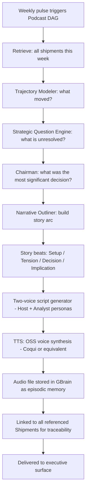


**Why two voices?** Single-voice narration is cognitively flat. Two voices — one as context-setter, one as questioner — naturally surface *the tension in decisions* without requiring the executive to read between the lines. The questioner voice is seeded with the open questions and minority positions from council deliberations.


---


## Part XII — n8n DAG Architecture (Q12)


### n8n as Orchestration Fabric, Not Business Logic


**Critical constraint:** n8n DAGs should contain **no cognitive logic**. They are pure orchestration: triggering, routing, sequencing, and logging. All intelligence lives in OCR services.


```mermaid

graph TB

    subgraph DAG1["DAG 1: Ingestion"]

        T1[Trigger: GitHub webhook]

        T2[Trigger: Obsidian file change]

        T3[Trigger: Scheduled scan]

        N1[Node: Classify signal type]

        N2[Node: Call Ontology Extractor API]

        N3[Node: Route to Shipment Compiler]

        N4[Node: Log to Audit Ledger]

        T1 & T2 & T3 --> N1

        N1 --> N2 --> N3 --> N4

    end



    subgraph DAG2["DAG 2: Shipment Lifecycle"]

        S1[Trigger: New shipment from Compiler]

        S2[Node: Activate GStack skills]

        S3[Node: Fan-out to council threads]

        S4[Node: Wait for all positions - timeout 5min]

        S5[Node: Call Chairman Synthesizer]

        S6[Node: Governance check]

        S7[Node: Commit to GBrain]

        S8[Node: Notify executive surface]

        S1-->S2-->S3-->S4-->S5-->S6-->S7-->S8

    end



    subgraph DAG3["DAG 3: Memory Consolidation"]

        M1[Trigger: Nightly at 02:00]

        M2[Node: Run decay algorithm]

        M3[Node: Promote candidate ontology nodes]

        M4[Node: Update trajectory vectors]

        M5[Node: Generate weekly summary if Monday]

        M1-->M2-->M3-->M4-->M5

    end



    subgraph DAG4["DAG 4: Governance Audit"]

        G1[Trigger: Any shipment committed]

        G2[Node: Hash shipment + synthesis]

        G3[Node: Write to append-only audit log]

        G4[Node: Check for policy violations]

        G5[Node: Alert if flagged]

        G1-->G2-->G3-->G4-->G5

    end



    subgraph DAG5["DAG 5: Executive Pulse"]

        E1[Trigger: Monday 08:00]

        E2[Node: Assemble weekly trajectory report]

        E3[Node: Run Podcast Synthesizer]

        E4[Node: Surface strategic questions]

        E5[Node: Deliver to executive surface]

        E1-->E2-->E3-->E4-->E5

    end

```


### DAG Evolution into Production (Q12)


**Phase 1 (Months 1-3):** Manual trigger DAGs. Everything requires human approval to proceed between states. Learn what the org's signals look like.


**Phase 2 (Months 4-6):** Semi-automatic. High-confidence, low-risk shipments auto-commit. Architectural shipments still require human escalation.


**Phase 3 (Months 7-12):** Governed automation. Full autonomy within defined policy boundaries. All exceptions escalate, never bypass.


**Never reach:** Fully autonomous cognition without human governance nodes. This is by design.


---


## Part XIII — Graph Schema (Q17 — GraphRAG)


### The OCR Graph is NOT a Knowledge Graph in the traditional sense


It is an **organizational cognitive graph** where the primary entities are *decisions, not facts*.


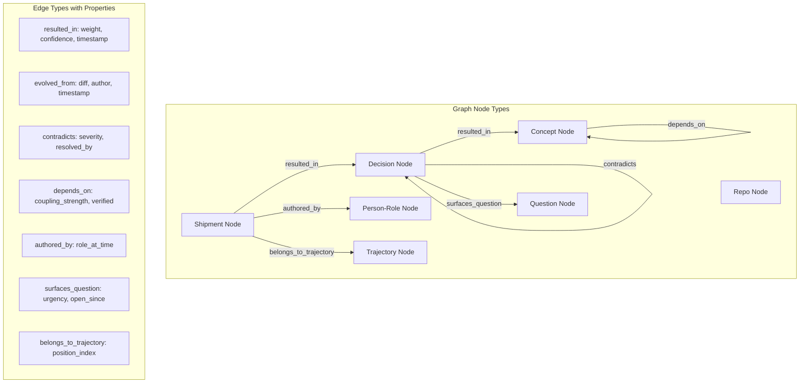


### GraphRAG in OCR (Q17)


GraphRAG is used in OCR but with a **critical constraint:** graph traversal is *ontology-guided*, not *similarity-guided*.


**Standard GraphRAG**: "Find nodes similar to query, expand neighborhood."


**OCR GraphRAG**: "Anchor to named ontology nodes in query, traverse by *relation type*, not similarity."


This means a query about "the decision to adopt OSS LLMs" doesn't surface random similar decisions — it surfaces:

- **The shipment that made that decision**

- **The council positions that argued for and against**

- **The trajectory it belongs to**

- **Any subsequent decisions that `depends_on` or `contradicts` it**

- **The concepts it `evolved_from`**


That is organizational intelligence, not semantic search.


---


## Part XIV — Replayability and Lineage (Q13)


### Every Cognition Event is Replayable


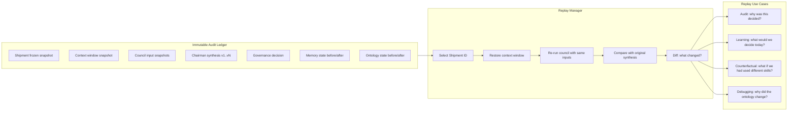


**Lineage is forward and backward:**

- **Backward lineage:** Given any organizational decision, trace every shipment, council deliberation, and memory fragment that contributed to it.

- **Forward lineage:** Given any shipment, trace every downstream decision, memory update, and trajectory change that flowed from it.


This answers the hardest executive question: *"Why are we where we are?"*


---


## Part XV — Governance and Auditability (Q14)


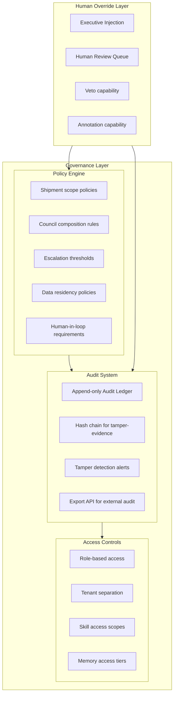


### Governance Philosophy


**Rule 1 — No orphan decisions.** Every committed decision must have a Shipment ID, a council record, and a governance hash. Decisions without lineage are blocked.


**Rule 2 — Human override always wins.** Executives can veto, annotate, or escalate any synthesis. These actions are themselves logged and become organizational memory.


**Rule 3 — Audit log is append-only.** No system component can delete audit entries. They can be redacted (PII) but the redaction event itself is logged.


**Rule 4 — Explainability before commitment.** No synthesis can be committed to GBrain without a human-readable rationale. This is enforced at the Governance Check node.


---


## Part XVI — MCP Ingestion Security (Q15)


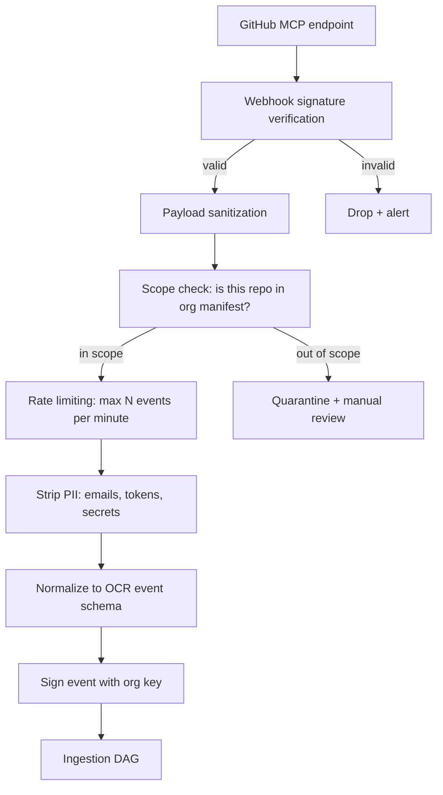


**Security principles for MCP ingestion:**

1. **Webhooks are verified** at the transport layer before any processing

2. **Scope manifests** define exactly which repos OCR is allowed to ingest — no default-allow

3. **Secret scanning** runs on every payload before ontology extraction — accidentally committed secrets are quarantined, not ingested into organizational memory

4. **Rate limiting** prevents ingestion floods from triggering runaway council activity

5. **Event signing** creates a trust chain from source to audit ledger


---


## Part XVII — Obsidian ↔ Repo Evolution Linkage (Q16)


### The Thinking-Doing Bridge


Obsidian is where organizational *thinking* lives. The repo is where organizational *doing* lives. The gap between them is where organizational intelligence is usually lost.


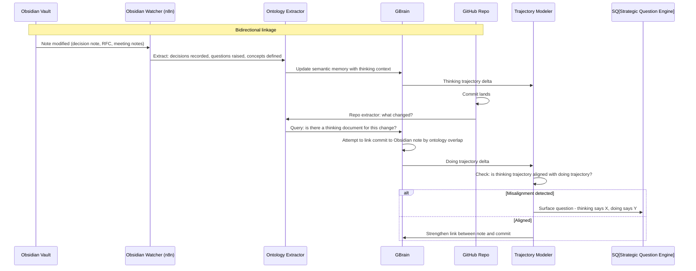


**The key insight:** When Obsidian notes and repo commits are ontologically linked, OCR can detect *strategy-execution drift* automatically. The org said it would do X (in notes/RFCs), but the repos are doing Y. That is a strategic signal, not a bug.


---


## Part XVIII — Semantic Persistence (Q18)


### How Meaning Survives System Changes


Semantic persistence is the hardest problem in organizational memory. Systems change, people leave, LLMs are replaced. How does meaning survive?


**OCR's answer: Ontology-grounded memory with source anchoring.**


Every memory fragment stores:

```json

{

  "content": "We decided to prioritize API-first because...",

  "ontology_anchors": ["concept:API-first", "concept:platform-strategy"],

  "source": {"type": "shipment", "id": "SHP-2025-0312"},

  "confidence": 0.91,

  "created_at": "2025-03-12T14:22:00Z",

  "last_activated": "2026-05-28T09:15:00Z",

  "activation_count": 14,

  "decay_rate": 0.02

}

```


When the LLM is replaced (say, from Llama 3 to Llama 4), the **ontology graph and memory fragments are LLM-agnostic** — they are structured data, not LLM-internal states. The new LLM reads the same memory; meaning persists.


---


## Part XIX — Multi-Tenant Cognition (Q19)


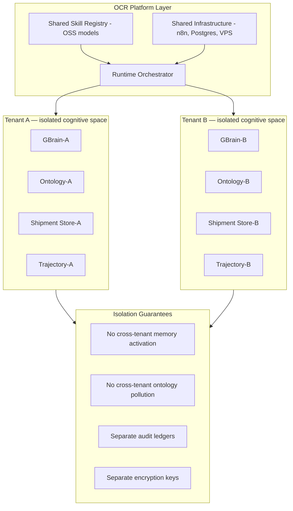


**Multi-tenancy is enforced at the memory layer, not the model layer.** The same OSS LLM can serve multiple tenants because the LLM is stateless — all organizational state lives in GBrain, which is tenant-isolated.


---


## Part XX — Deployment Architecture


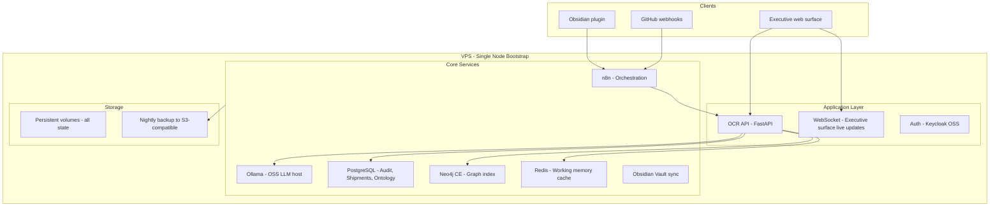


**Bootstrap cost estimate:**

| Component | Cost |

|---|---|

| VPS (8 core, 32GB, 500GB NVMe) | ~$40-80/month |

| OSS LLM (Llama 3 8B on-device) | $0 extra |

| n8n (self-hosted) | $0 |

| Neo4j Community Edition | $0 |

| PostgreSQL | $0 |

| Obsidian + plugin | ~$10/month |

| **Total** | **~$50-100/month** |


This is enterprise organizational intelligence for under $100/month to start.


---


## Part XXI — The Long-Term Moat (Q20)


### Why OCR Becomes Irreplaceable


The moat is **not technical**. Any company can replicate the n8n DAGs, the OSS LLMs, the vector store. The moat is:


**1. Accumulated Organizational Memory (12-36 months)**

After a year of shipments, councils, and trajectory deltas, OCR contains something no competitor can replicate: the actual cognitive history of your organization. Every decision, every dissent, every counterfactual branch. This is worth more than any model.


**2. Ontology as Competitive Intelligence**

The organizational ontology, evolved over time, represents the organization's unique understanding of its domain. Concepts, relations, and their evolutions are a map of how the org thinks. This cannot be transferred or copied.


**3. Replayable Decision History**

When a new executive joins, instead of reading 200 documents, they replay the last 20 significant shipments through the executive surface. They inherit organizational cognition, not just information.


**4. Trajectory as Forecasting**

After 24+ months of trajectory data, OCR can surface *leading indicators* of strategic drift, execution risk, and opportunity — not by predicting the future, but by recognizing patterns in the organization's own history.


**5. Trust**

Executives who have used OCR for 18 months trust it because every synthesis they've seen has been traceable, explainable, and has a lineage they can audit. Trust is the ultimate moat.


---


## Part XXII — Roadmap Evolution


```mermaid

gantt

    title OCR Platform Roadmap

    dateFormat  YYYY-MM

    axisFormat  %b %Y


    section Foundation

    VPS + n8n + OSS LLM setup       :2026-06, 2026-07

    GitHub MCP ingestion             :2026-07, 2026-08

    Basic Ontology Extractor         :2026-07, 2026-08

    Shipment Compiler v1             :2026-08, 2026-09


    section Cognition Core

    GStack Skill Registry v1         :2026-09, 2026-10

    Council Orchestrator v1          :2026-09, 2026-11

    Chairman Synthesizer v1          :2026-10, 2026-11

    GBrain Memory Layer v1           :2026-11, 2027-01


    section Memory and Graph

    Neo4j Graph Integration          :2027-01, 2027-02

    Trajectory Modeler v1            :2027-02, 2027-03

    Obsidian Linkage                 :2027-02, 2027-04

    Strategic Question Engine v1     :2027-03, 2027-04


    section Executive Surface

    Executive Dashboard v1           :2027-04, 2027-06

    Podcast Synthesizer v1           :2027-05, 2027-06

    Replay Manager v1                :2027-06, 2027-07


    section Enterprise Grade

    Governance and Audit Layer       :2027-07, 2027-09

    Multi-tenant isolation           :2027-08, 2027-10

    Enterprise Auth and RBAC         :2027-09, 2027-10

    Ontology Evolution v2            :2027-10, 2028-01

```


---


## Closing Architectural Principles


These are the **first principles** that should govern every implementation decision in OCR:


> **1. Cognition before Automation**

> The system should help the organization *think better*, not just act faster. Slow down decisions to improve decision quality.


> **2. Memory before Intelligence**

> A system with excellent memory and average reasoning outperforms a system with brilliant reasoning and no memory. Build GBrain first.


> **3. Ontology before RAG**

> Never query by similarity when you can navigate by meaning. Every retrieval should traverse the ontology graph before touching the vector index.


> **4. Deliberation before Synthesis**

> Never synthesize from a single perspective. Every committed decision must have survived the council. This is not inefficiency — it is the entire point.


> **5. Lineage before Action**

> Nothing is committed without a traceable lineage. The audit trail is not a compliance feature — it is the foundation of organizational trust in the system.


> **6. Replayability as Infrastructure**

> The ability to replay any cognitive event from any point in the past is not a debugging tool — it is the organization's institutional learning mechanism.


> **7. Human sovereignty always**

> OCR never executes a decision that was not reviewed or at minimum reviewable by a human. Automation operates within human-defined boundaries, not beyond them.


This is what persistent organizational intelligence infrastructure looks like. Not agent chaos. Not prompt engineering at scale. An actual **cognitive operating system for organizations** — built from first principles, starting on a single VPS, growing into the irreplaceable core of how the organization knows itself.x