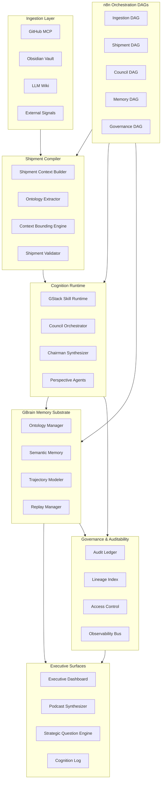

## Part I — System Overview Architecture

```mermaid

graph TB

    subgraph INGESTION["Ingestion Layer"]

        GH[GitHub MCP]

        OB[Obsidian Vault]

        WIKI[LLM Wiki]

        EXT[External Signals]

    end


    subgraph COMPILER["Shipment Compiler"]

        SC[Shipment Context Builder]

        OE[Ontology Extractor]

        CB[Context Bounding Engine]

        SV[Shipment Validator]

    end


    subgraph COGNITION["Cognition Runtime"]

        GS[GStack Skill Runtime]

        CO[Council Orchestrator]

        CH[Chairman Synthesizer]

        PA[Perspective Agents]

    end


    subgraph MEMORY["GBrain Memory Substrate"]

        OM[Ontology Manager]

        SM[Semantic Memory]

        TM[Trajectory Modeler]

        RM[Replay Manager]

    end


    subgraph SURFACES["Executive Surfaces"]

        ED[Executive Dashboard]

        PD[Podcast Synthesizer]

        SQ[Strategic Question Engine]

        CL[Cognition Log]

    end


    subgraph ORCH["n8n Orchestration DAGs"]

        N1[Ingestion DAG]

        N2[Shipment DAG]

        N3[Council DAG]

        N4[Memory DAG]

        N5[Governance DAG]

    end


    subgraph GOV["Governance & Auditability"]

        AL[Audit Ledger]

        LI[Lineage Index]

        AC[Access Control]

        OB2[Observability Bus]

    end


    INGESTION --> COMPILER

    COMPILER --> COGNITION

    COGNITION --> MEMORY

    MEMORY --> SURFACES

    ORCH --> COMPILER

    ORCH --> COGNITION

    ORCH --> MEMORY

    COGNITION --> GOV

    MEMORY --> GOV

    GOV --> SURFACES

```

---
