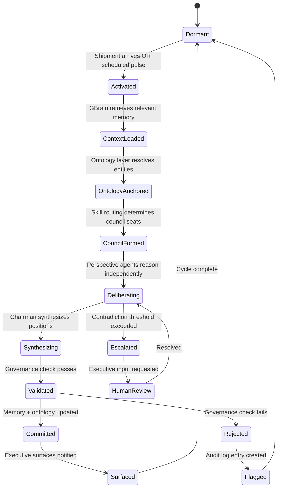

## Part II — Cognition Runtime Architecture (Deep)

The Cognition Runtime is the *brain* of OCR. It is not a pipeline. It is a **state machine with deliberative capacity**.

### Key Insight on the Runtime State Machine

The runtime **never executes blindly**. Every state transition is:

1. Logged to the Audit Ledger

2. Tagged with the triggering Shipment ID

3. Reversible (via Replay Manager)

4. Ontology-anchored (entities are resolved before deliberation begins)

This is what separates OCR from "n8n with GPT-4 nodes."

---
