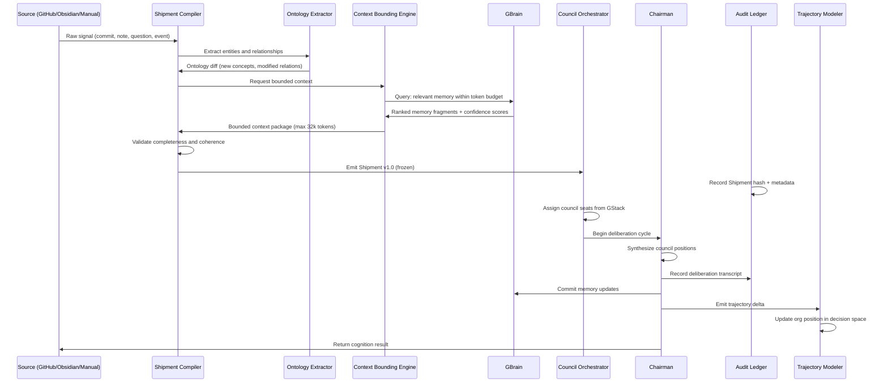

## Part III — Shipment Architecture

### What is a Shipment?

A **Shipment** is the atomic unit of intentional organizational cognition. It is NOT a task, a prompt, or a workflow. It is a **bounded cognitive event** with:

- A **declared intent** (what is this trying to accomplish?)

- A **context window** (what organizational knowledge is relevant?)

- A **council assignment** (which perspectives must reason about this?)

- A **commitment record** (what was decided and why?)

- A **trajectory delta** (how did this change the org's cognitive state?)

### Shipment Lifecycle

### Shipment Context Window Bounding (Q2)

The context window bounding problem is **the hardest engineering problem in OCR**. Generic RAG fails here because it optimizes for similarity, not for *cognitive relevance*.

**The Context Bounding Engine uses a 4-layer relevance model:**

| Layer | What it selects | Token budget |

|---|---|---|

| **Ontological Core** | The entities directly named in the shipment, their first-order relations | 20% |

| **Trajectory Context** | Recent decisions on the same trajectory path | 30% |

| **Contradicting Evidence** | Memory fragments that *oppose* the current signal | 15% |

| **Skill Prerequisites** | What the assigned skills need to reason well | 20% |

| **Headroom** | Reserved for council synthesis expansion | 15% |

**Why contradicting evidence gets its own budget:** Organizations consistently make bad decisions because dissenting signals are under-weighted in context. Building contradiction into the context window is a first-principles structural guarantee against groupthink.

---
