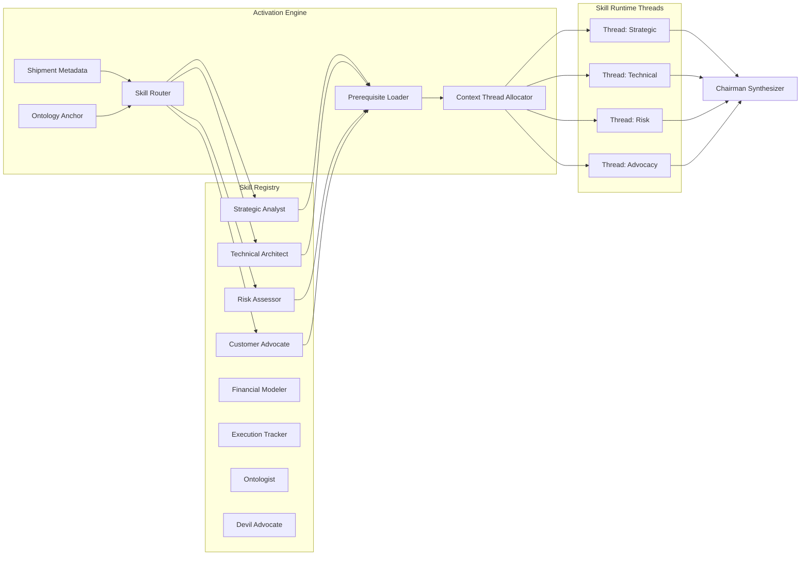

## Part IV — GStack Skill Activation Runtime (Q1)


### What is GStack?


GStack is the **skill registry and activation runtime** of OCR. Skills are not prompts. Skills are **cognitive roles** with:

- A declared **perspective** (what angle do they reason from?)

- A **prerequisite ontology** (what concepts must be resolved before activation?)

- A **reasoning protocol** (chain-of-thought structure, not free-form)

- A **confidence signature** (how certain is this skill's output?)

- A **jurisdiction** (what types of shipments can this skill reason about?)





### Skill Activation Logic (Deep)


Skill activation is **not LLM-based routing** (which is flaky and ungovernable). It uses a **deterministic ontology-matching algorithm:**


```

ActivationScore(skill, shipment) =

    w1 * OntologyOverlap(skill.jurisdiction, shipment.entities) +

    w2 * TrajectoryRelevance(skill.history, shipment.trajectory) +

    w3 * CouncilBalance(current_council, skill.perspective) +

    w4 * PriorContribution(skill.id, similar_shipments)

```


**CouncilBalance is critical:** If the current council has 3 technical skills and 0 advocacy skills, the activation engine *forces* advocacy activation even if ontology overlap is low. This prevents echo chambers.


**Skills activate in parallel threads**, each with their own context slice. The Chairman does NOT see individual threads during deliberation — it only receives **position summaries** after independent reasoning completes. This enforces genuine deliberative independence.


---
