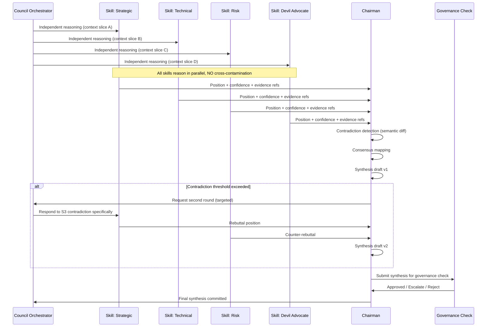

## Part V — Council Architecture (Q3, Q4)


### Council Deliberation Protocol





### Chairman Synthesis (Q4)


The Chairman is **not the smartest LLM**. The Chairman is a **structured synthesis protocol** running on a reasoning-capable OSS model.


Its job is strictly:

1. **Map convergence** — Where do skills agree? This becomes high-confidence output.

2. **Map divergence** — Where do skills disagree? This becomes the *strategic question* (not an error).

3. **Weight by evidence** — Skills that reference ontology-anchored evidence > skills reasoning abstractly.

4. **Preserve dissent** — The synthesis document always contains a "minority position" section. Dissent is organizational memory, not noise.

5. **Declare unknowns** — If no skill can resolve a contradiction, the Chairman declares an explicit *open question* and routes it to the Strategic Question Engine.


**Chairman Output Schema:**

```json

{

  "shipment_id": "SHP-2026-0847",

  "synthesis": {

    "consensus_positions": [...],

    "minority_positions": [...],

    "open_questions": [...],

    "confidence": 0.82,

    "evidence_references": ["ONT-042", "MEM-8821", "REPO-commit-a4f3"]

  },

  "trajectory_delta": {

    "affected_concepts": [...],

    "position_shift": "vector",

    "decision_type": "strategic | tactical | architectural | operational"

  },

  "governance": {

    "requires_human_review": false,

    "risk_flags": [],

    "audit_hash": "sha256:..."

  }

}

```


---
