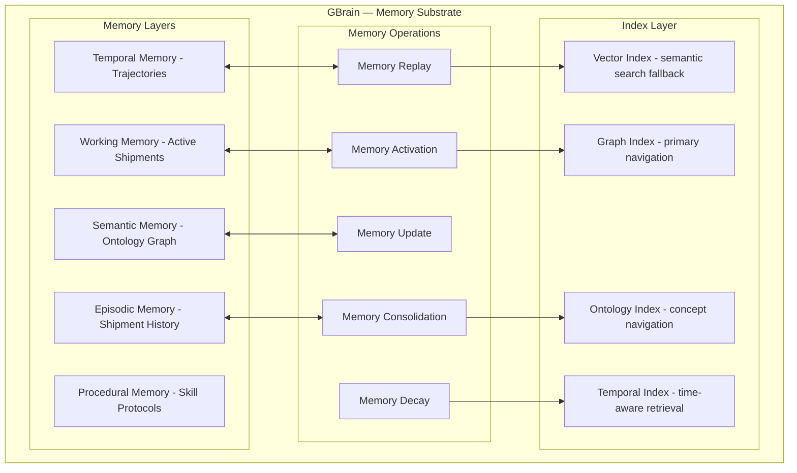

## Part VI — GBrain Memory Architecture (Q5, Q18)

### GBrain is NOT a Vector Store

This is the most important architectural distinction. A vector store does **semantic similarity retrieval**. GBrain does **cognitive state management**.

### Memory Activation Protocol (Q5)

When a Shipment arrives, GBrain doesn't "search" — it **activates**:

**Step 1 — Ontology Anchor**: Resolve all named entities to graph nodes. This is the primary activation signal.

**Step 2 — Trajectory Walk**: From each anchored node, walk the trajectory graph backward 3-5 decision steps. This surfaces *how we got here* automatically.

**Step 3 — Contradiction Surface**: Query the graph for edges of type `contradicts` or `supersedes` attached to activated nodes.

**Step 4 — Recency Decay**: Apply temporal decay to weight recent decisions more heavily, but *never discard* distant decisions — they become part of "organizational lore."

**Step 5 — Confidence Propagation**: Memory fragments carry confidence scores that degrade with each relay (episodic → semantic → procedural). This prevents "telephone game" distortion.

---
