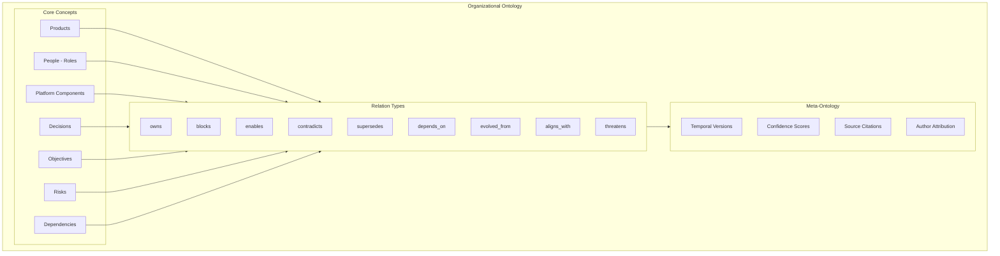
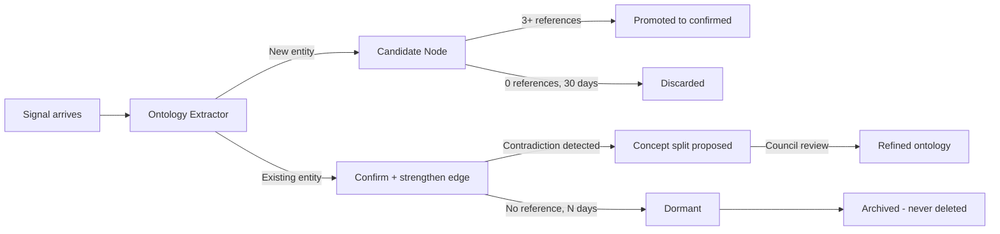

## Part VII — Ontology Architecture (Q6, Q17)

### Ontology is the Backbone, Not an Add-On

The ontology is the **shared cognitive substrate** of the entire organization. Without it, every LLM call is contextless. With it, every LLM call is anchored to the organization's actual world.

### Ontology Evolution Design (Q6)

Ontologies must evolve or they become stale organizational debt. OCR uses **4 evolution mechanisms**:

**1. Shipment-Driven Evolution**

Every committed Shipment runs through the Ontology Extractor. New entities are proposed as `candidate` nodes. After 3+ independent shipments reference the same candidate entity, it is promoted to `confirmed`. This prevents ontology pollution from one-off signals.

**2. Contradiction-Driven Refinement**

When a council deliberation surfaces a contradiction, the Ontologist skill examines whether the contradiction stems from *ontological ambiguity* (two different meanings for the same term). If so, it proposes a concept split.

**3. Decay and Archival**

Concepts not referenced in any Shipment for N days are flagged as `dormant`. Dormant concepts are archived (never deleted) and their relations are weakened. This keeps the active ontology relevant without losing history.

**4. Executive Injection**

Executives can directly inject new ontology concepts via the Executive Surface. These bypass the 3-shipment rule but are flagged as `executive-origin` and require higher council scrutiny when referenced.

---
