## Part VIII — Trajectory Modeling (Q7)

### Organizational Trajectories

A trajectory is the **path an organization has taken through its decision space**. Every committed Shipment emits a trajectory delta — a vector displacement in a high-dimensional concept space.

**This is not metaphorical.** Trajectories are stored as:

- A sequence of decision events tagged with timestamps and Shipment IDs

- A concept space representation (the set of active ontology nodes and their weights at each point in time)

- A **momentum vector** (the direction and velocity of recent decisions)

- **Branch points** (decisions where the council was split — these are high-value strategic memory)

```mermaid

graph LR

    T0[T0: Org State] --> D1[Decision: Platform v1]

    D1 --> T1[T1: Org State]

    T1 --> D2[Decision: API-first]

    T1 --> D2B[Decision: Monolith-first - NOT TAKEN]

    D2B -.->|counterfactual stored| CF[Counterfactual Branch]

    D2 --> T2[T2: Org State]

    T2 --> D3[Decision: OSS LLM adoption]

    D3 --> T3[T3: Org State - Current]

    T3 --> |momentum| PROJ[Projected trajectory]

    PROJ --> |uncertainty cone| FUT[Future Decision Space]



    style CF fill:#2d1b1b,stroke:#8b0000

    style PROJ fill:#1b2d1b,stroke:#006400

    style FUT fill:#1b1b2d,stroke:#000080

```

### Strategic Question Emergence (Q8)

Strategic questions are **not generated by asking an LLM "what should we think about?"** That produces generic noise.

Strategic questions *emerge* from trajectory analysis:

1. **Momentum Divergence**: When the trajectory momentum vector changes direction sharply (measured by cosine similarity of recent vs. historical trajectory deltas), the system emits a strategic question: *"Something is shifting — is this intentional?"*

2. **Unresolved Contradiction Accumulation**: When 3+ shipments in a time window all contain open questions on the same ontology cluster, the Strategic Question Engine consolidates them into one explicit strategic question surfaced to executives.

3. **Counterfactual Aging**: When a counterfactual branch (not-taken decision) reaches an age where its assumptions can now be tested against reality, the system surfaces it: *"We chose X over Y. Here's what Y would have looked like."*

4. **Trajectory-Ontology Mismatch**: When the org's stated objectives (in the ontology) diverge from the actual trajectory direction (measured by which concepts are most active in recent shipments), a strategic question is surfaced automatically.

---
