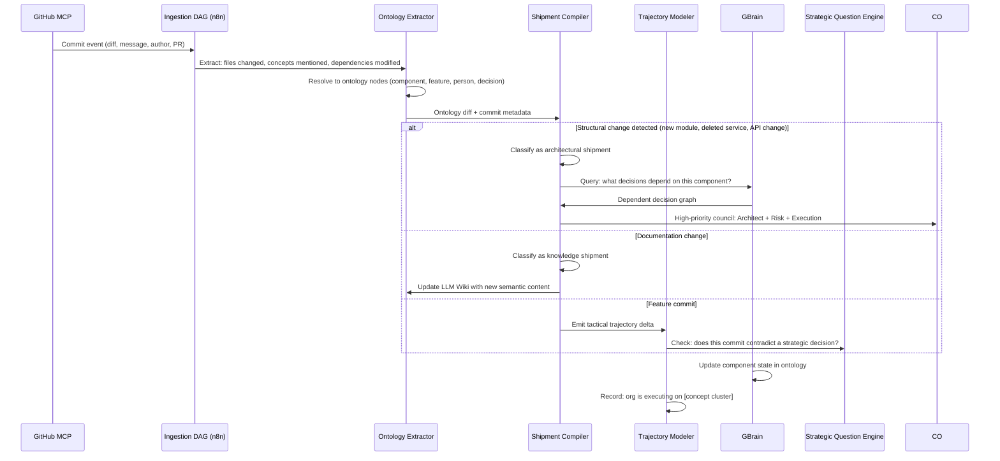

## Part IX — Repo Changes and Organizational State (Q9)

### GitHub MCP → Org State Pipeline

**Key insight:** Not every commit should trigger a full council. The Shipment Compiler uses a **significance classifier** (deterministic rules + lightweight LLM for edge cases) to route commits to:

- **Architectural Shipments** → Full council deliberation

- **Tactical Shipments** → Lightweight logging + ontology update

- **Knowledge Shipments** → Wiki + ontology update only

- **Signal Shipments** → Trajectory logging only

This keeps the system from drowning in noise.

---
