## Part X — Executive Cognition Surfaces (Q10)

### What Executives Actually Need

Executives do not need dashboards with 47 metrics. They need:

1. **Where are we?** (current organizational state)

2. **How did we get here?** (trajectory with decision lineage)

3. **What is unresolved?** (open strategic questions)

4. **What should I decide?** (escalations requiring executive input)

5. **What did I decide before and how is it playing out?** (longitudinal accountability)

```mermaid

graph TB

    subgraph EXEC["Executive Cognition Surface"]

        subgraph NOW["Now View"]

            CS[Current State Snapshot]

            AQ[Active Questions]

            ES[Escalations Awaiting Input]

        end



        subgraph TRAJECTORY["Trajectory View"]

            DL[Decision Log - last 90 days]

            MM[Momentum Map - concept activity heatmap]

            CF[Counterfactual Browser]

        end



        subgraph DEEP["Deep Dive"]

            SR[Shipment Replay]

            CD[Council Deliberation Transcripts]

            OV[Ontology Visualizer]

        end



        subgraph AUDIO["Audio Synthesis"]

            PD[Weekly Cognition Podcast]

            BF[Decision Briefing]

        end

    end



    GB[GBrain] --> CS & DL & MM

    SQ[Strategic Questions] --> AQ

    GOV[Governance Layer] --> ES

    TM[Trajectory Model] --> CF & MM

    RM[Replay Manager] --> SR & CD

    OM[Ontology] --> OV

    CH[Chairman Transcripts] --> PD & BF

```

### Non-Technical Reasoning Surfaces

For executives who are not engineers, OCR surfaces cognition in **narrative form**, not data form:

- Every Shipment synthesis has a **plain-language executive summary** generated by a dedicated translation skill

- The Trajectory View shows decisions as **story arcs**, not graphs

- Strategic Questions are phrased as **genuine questions**, not metrics alerts

- The Podcast Synthesizer (Q11) converts weekly cognition into spoken narrative

---
