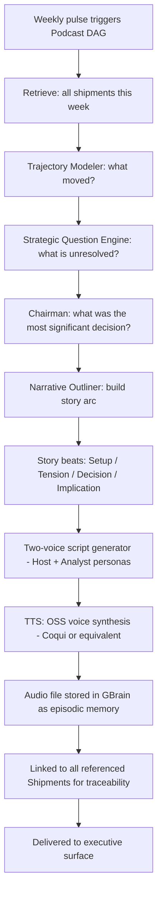

## Part XI — Podcast / NotebookLM-Style Synthesis (Q11)

### How Cognition Becomes Narrative

The weekly cognition podcast is not a report read aloud. It is a **structured narrative synthesis** of the week's cognitive activity.

**Generation Protocol:**

**Why two voices?** Single-voice narration is cognitively flat. Two voices — one as context-setter, one as questioner — naturally surface *the tension in decisions* without requiring the executive to read between the lines. The questioner voice is seeded with the open questions and minority positions from council deliberations.

---
