## Part XII — n8n DAG Architecture (Q12)

### n8n as Orchestration Fabric, Not Business Logic

**Critical constraint:** n8n DAGs should contain **no cognitive logic**. They are pure orchestration: triggering, routing, sequencing, and logging. All intelligence lives in OCR services.

```mermaid

graph TB

    subgraph DAG1["DAG 1: Ingestion"]

        T1[Trigger: GitHub webhook]

        T2[Trigger: Obsidian file change]

        T3[Trigger: Scheduled scan]

        N1[Node: Classify signal type]

        N2[Node: Call Ontology Extractor API]

        N3[Node: Route to Shipment Compiler]

        N4[Node: Log to Audit Ledger]

        T1 & T2 & T3 --> N1

        N1 --> N2 --> N3 --> N4

    end



    subgraph DAG2["DAG 2: Shipment Lifecycle"]

        S1[Trigger: New shipment from Compiler]

        S2[Node: Activate GStack skills]

        S3[Node: Fan-out to council threads]

        S4[Node: Wait for all positions - timeout 5min]

        S5[Node: Call Chairman Synthesizer]

        S6[Node: Governance check]

        S7[Node: Commit to GBrain]

        S8[Node: Notify executive surface]

        S1-->S2-->S3-->S4-->S5-->S6-->S7-->S8

    end



    subgraph DAG3["DAG 3: Memory Consolidation"]

        M1[Trigger: Nightly at 02:00]

        M2[Node: Run decay algorithm]

        M3[Node: Promote candidate ontology nodes]

        M4[Node: Update trajectory vectors]

        M5[Node: Generate weekly summary if Monday]

        M1-->M2-->M3-->M4-->M5

    end



    subgraph DAG4["DAG 4: Governance Audit"]

        G1[Trigger: Any shipment committed]

        G2[Node: Hash shipment + synthesis]

        G3[Node: Write to append-only audit log]

        G4[Node: Check for policy violations]

        G5[Node: Alert if flagged]

        G1-->G2-->G3-->G4-->G5

    end



    subgraph DAG5["DAG 5: Executive Pulse"]

        E1[Trigger: Monday 08:00]

        E2[Node: Assemble weekly trajectory report]

        E3[Node: Run Podcast Synthesizer]

        E4[Node: Surface strategic questions]

        E5[Node: Deliver to executive surface]

        E1-->E2-->E3-->E4-->E5

    end

```

### DAG Evolution into Production (Q12)

**Phase 1 (Months 1-3):** Manual trigger DAGs. Everything requires human approval to proceed between states. Learn what the org's signals look like.

**Phase 2 (Months 4-6):** Semi-automatic. High-confidence, low-risk shipments auto-commit. Architectural shipments still require human escalation.

**Phase 3 (Months 7-12):** Governed automation. Full autonomy within defined policy boundaries. All exceptions escalate, never bypass.

**Never reach:** Fully autonomous cognition without human governance nodes. This is by design.

---
