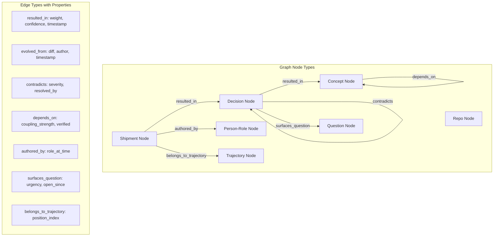

## Part XIII — Graph Schema (Q17 — GraphRAG)

### The OCR Graph is NOT a Knowledge Graph in the traditional sense

It is an **organizational cognitive graph** where the primary entities are *decisions, not facts*.

### GraphRAG in OCR (Q17)

GraphRAG is used in OCR but with a **critical constraint:** graph traversal is *ontology-guided*, not *similarity-guided*.

**Standard GraphRAG**: "Find nodes similar to query, expand neighborhood."

**OCR GraphRAG**: "Anchor to named ontology nodes in query, traverse by *relation type*, not similarity."

This means a query about "the decision to adopt OSS LLMs" doesn't surface random similar decisions — it surfaces:

- **The shipment that made that decision**

- **The council positions that argued for and against**

- **The trajectory it belongs to**

- **Any subsequent decisions that `depends_on` or `contradicts` it**

- **The concepts it `evolved_from`**

That is organizational intelligence, not semantic search.

---
