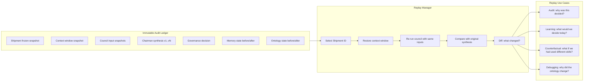

## Part XIV — Replayability and Lineage (Q13)

### Every Cognition Event is Replayable

**Lineage is forward and backward:**

- **Backward lineage:** Given any organizational decision, trace every shipment, council deliberation, and memory fragment that contributed to it.

- **Forward lineage:** Given any shipment, trace every downstream decision, memory update, and trajectory change that flowed from it.

This answers the hardest executive question: *"Why are we where we are?"*

---
