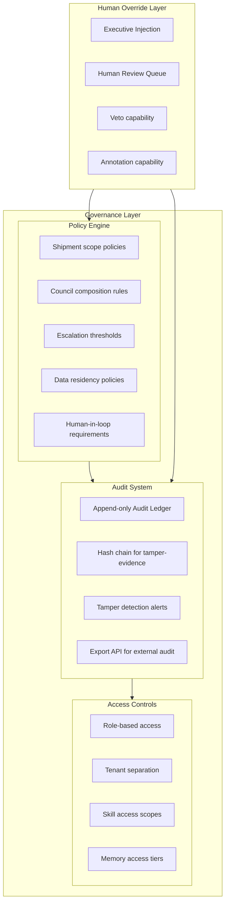

## Part XV — Governance and Auditability (Q14)

### Governance Philosophy

**Rule 1 — No orphan decisions.** Every committed decision must have a Shipment ID, a council record, and a governance hash. Decisions without lineage are blocked.

**Rule 2 — Human override always wins.** Executives can veto, annotate, or escalate any synthesis. These actions are themselves logged and become organizational memory.

**Rule 3 — Audit log is append-only.** No system component can delete audit entries. They can be redacted (PII) but the redaction event itself is logged.

**Rule 4 — Explainability before commitment.** No synthesis can be committed to GBrain without a human-readable rationale. This is enforced at the Governance Check node.

---
