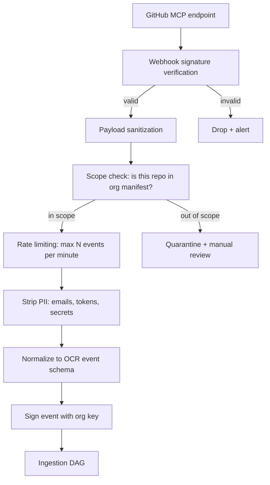

## Part XVI — MCP Ingestion Security (Q15)

**Security principles for MCP ingestion:**

1. **Webhooks are verified** at the transport layer before any processing

2. **Scope manifests** define exactly which repos OCR is allowed to ingest — no default-allow

3. **Secret scanning** runs on every payload before ontology extraction — accidentally committed secrets are quarantined, not ingested into organizational memory

4. **Rate limiting** prevents ingestion floods from triggering runaway council activity

5. **Event signing** creates a trust chain from source to audit ledger

---
