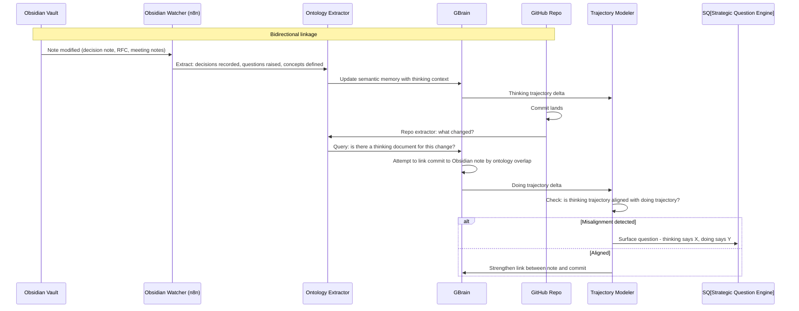

## Part XVII — Obsidian ↔ Repo Evolution Linkage (Q16)

### The Thinking-Doing Bridge

Obsidian is where organizational *thinking* lives. The repo is where organizational *doing* lives. The gap between them is where organizational intelligence is usually lost.

**The key insight:** When Obsidian notes and repo commits are ontologically linked, OCR can detect *strategy-execution drift* automatically. The org said it would do X (in notes/RFCs), but the repos are doing Y. That is a strategic signal, not a bug.

---
