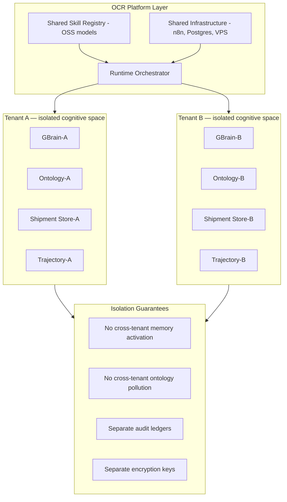

## Part XIX — Multi-Tenant Cognition (Q19)

**Multi-tenancy is enforced at the memory layer, not the model layer.** The same OSS LLM can serve multiple tenants because the LLM is stateless — all organizational state lives in GBrain, which is tenant-isolated.

---
