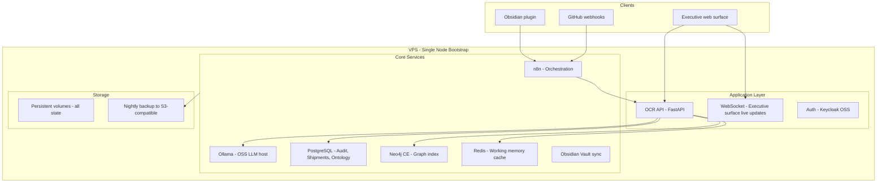

## Part XX — Deployment Architecture

**Bootstrap cost estimate:**

| Component | Cost |

|---|---|

| VPS (8 core, 32GB, 500GB NVMe) | ~$40-80/month |

| OSS LLM (Llama 3 8B on-device) | $0 extra |

| n8n (self-hosted) | $0 |

| Neo4j Community Edition | $0 |

| PostgreSQL | $0 |

| Obsidian + plugin | ~$10/month |

| **Total** | **~$50-100/month** |

This is enterprise organizational intelligence for under $100/month to start.

---
