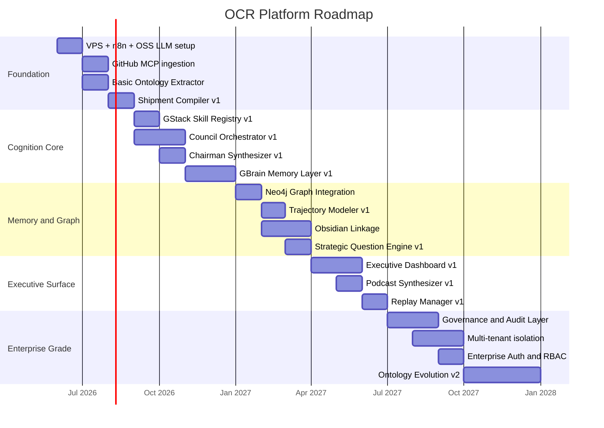

## Part XXII — Roadmap Evolution

```mermaid

gantt

    title OCR Platform Roadmap

    dateFormat  YYYY-MM

    axisFormat  %b %Y


    section Foundation

    VPS + n8n + OSS LLM setup       :2026-06, 2026-07

    GitHub MCP ingestion             :2026-07, 2026-08

    Basic Ontology Extractor         :2026-07, 2026-08

    Shipment Compiler v1             :2026-08, 2026-09


    section Cognition Core

    GStack Skill Registry v1         :2026-09, 2026-10

    Council Orchestrator v1          :2026-09, 2026-11

    Chairman Synthesizer v1          :2026-10, 2026-11

    GBrain Memory Layer v1           :2026-11, 2027-01


    section Memory and Graph

    Neo4j Graph Integration          :2027-01, 2027-02

    Trajectory Modeler v1            :2027-02, 2027-03

    Obsidian Linkage                 :2027-02, 2027-04

    Strategic Question Engine v1     :2027-03, 2027-04


    section Executive Surface

    Executive Dashboard v1           :2027-04, 2027-06

    Podcast Synthesizer v1           :2027-05, 2027-06

    Replay Manager v1                :2027-06, 2027-07


    section Enterprise Grade

    Governance and Audit Layer       :2027-07, 2027-09

    Multi-tenant isolation           :2027-08, 2027-10

    Enterprise Auth and RBAC         :2027-09, 2027-10

    Ontology Evolution v2            :2027-10, 2028-01

```
